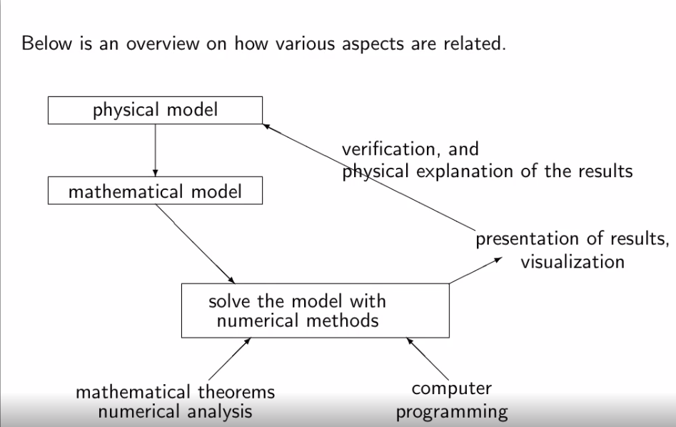
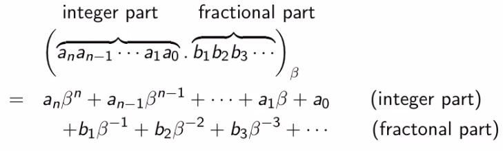
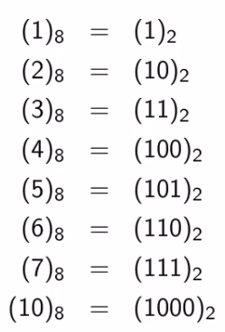
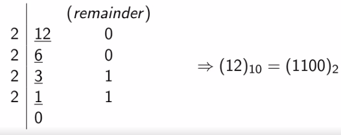
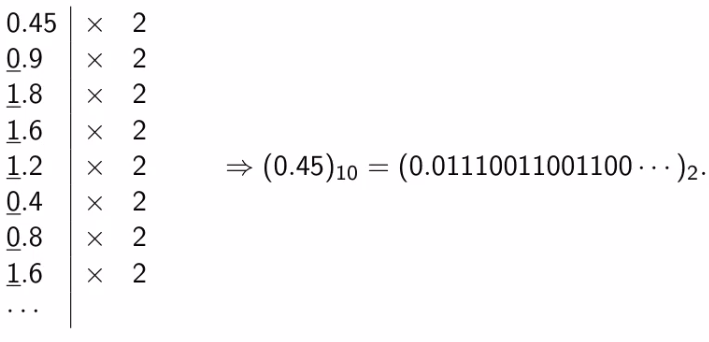
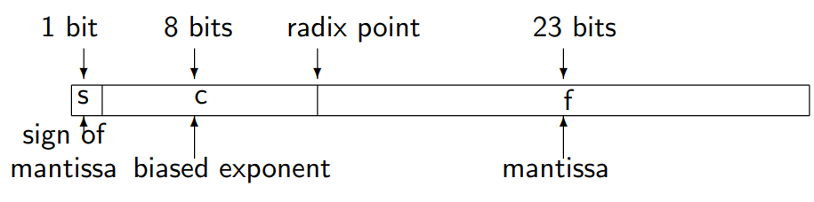
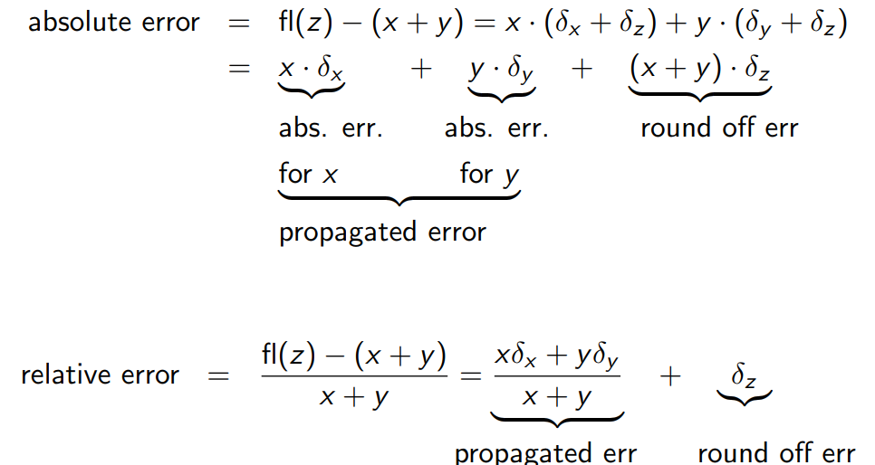

---
title: "Chapter 1: Computer Arithmetic"
output:
  pdf_document: 
    toc: true
    toc_depth: 2
    number_sections: true
  html_notebook: default
---

```{r include = FALSE}
# refresh environment
rm(list = ls())
library(dplyr) # utility package for tidyverse
library(R.matlab)
library(tidyverse)
```

# Introduction to Numerical Computation

## Numerical Methods

They are **algorithms** that compute **approximations** to functions, their derivatives, their integrations, and solutions to various equations etc. Such algorithms could be programmed on a computer.



Numerical methods are not about numbers. It is about mathematical ideas and insight. A little idea can go a long way. Some classical problems:

* Development of algoritms
* Implementation
* Some analysis, including error-estimates, convergence, stability, etc.

**Matlab**

# Representation of numbers in different bases

There have been several different ways of representing numbers:

* 10: decimal, daily use
* 2: binary, computer use
* 8: octal
* 16: hexadecimal, ancient China
* 20: vigesimal, ancient France (can be seen in french language)
* 60: sexagesimal, used by Babylonians

In principle we can use any number $\beta$ as the base. Writing such a number with a decimal point gives us an integer part and fraciton part.



This above formula allows us to convert a number in any base $\beta$ into base 10.

## Examples

### Octal to Decimal

We have (45.12)~8~.
\[
4 * 8^1 + 5 * 8^0 + 1 * 8^{-1} + 2 * 8^{-2} = (37.15625)_{10}
\]

### Octal to Binary



Since 8 is a power of 2 it makes it very easy to convert from octal to binary:
\[
(5034)_8 = (101 000 011 100)_2
\]

Each digit in octal gets converted to 3 digits in binary. And vice versa...

You can also go back from binary to octal:
\[
(110010111001)_2 = (6271)_8
\]

### Decimal to Binary

Write (12.45)~10~ in binary. (base 2)
This is particularly interesting because we use decimal and computer uses binary.
This conversion takes two steps.
First we convert the integer part into binary.

Procedure: Divide the integer by 2 and store the remainder of each step until integer is zero. (Euclid's algorithm.)



Now to convert the fractional part to binary you multiply by 2 and store the integer part for the result.



Note that the fractional part here is not finite.
Putting them together:
\[
(12.45)_{10} = (1100.01110011001100...)_2
\]

So how do we store this kind of a number in a computer?

# Floating Point Representation

Recall normalized scientifi notation for a real number x:

* Decimal: $x = \pm r * 10^n$, where $1 \leq r < 10$
* Binary: $x = \pm r * 2^n$, where $1 \leq r < 2$
* Octal: $x = \pm r * 8^n$ where $1 \leq r < 8$

So for any base $\beta$: $x = \pm r * \beta^n$ where $1 \leq r < \beta$

Information to be stored:

1. The sign
2. The exponent n
3. The value of r

The computer uses the binary version of the number system. They represent numbers with finite lenght. These are called machine numbers.

r: the normalized mantissa. For binary numbers we have

r = 1.(fractional part)

Therfore, in the computer we will only store the fractional part of the number

n: exponent. If n > 0, then x > 1, but if n < 0, then x > 1.

s: The sign of the number. If s = 0, it is positive and if s = 1, it is negative.

Each bit can store the value of either 0 or 1.

## Single precision IEEE standard floating-point, in a 32-bit computer



The exponent: 2^8^ = 256. It can represent numbers from -127 to 128. The value of the number (in exponential notation):
\[
(-1)^s *2^{c-127}*(1.f)_2
\]

The smallest representable number in absolute value is:
\[
x_{min} = 2^{-127} \approx 5.9 * 10^{-39}
\]

The largest representable number in absolute value is:
\[
x_{max} = 2^{128} \approx 2.4 * 10^{38}
\]

Computers can only handle numbers with absolute values between x~min~ and x~max~.

We say that x underflows if $\lvert x\rvert < x_{min}$ In this case we consider x = 0.
We say that x overflows if $\lvert x\rvert > x{max}$ In this case we consdier x to be infinite.

Let fl(x) denote the floating point representation of the number x. In gener it contains error (roundoff or chopping).
\[
fl(x) = x*(1 + \delta)
\]
Relative Error: $\delta = \frac{fl(x) - x}{x}$
Absolute Error: $fl(x) - x = \delta * x$

Computer errors in representing numbers:

* Relative error in rounding off: $\delta \leq 0.5 * 2^{-23} \approx 0.6 * 10^{-7}$
* Relative error in chopping: $\delta \leq 1 * 2^{-23} \approx 1.2 * 10^{-7}$

## Error Propogation (through arithmetic operation)

Example 1: Consider an addition, say z = x + y, done in a computer. How would the errors be propagated?

Let x > 0, y > 0, and let fl(x), fl(y) be their floating point representation.
\[
fl(x) = x(1 + \delta_x), fl(y) = y(1 + \delta_y)
\]

where $\delta_x,\delta_y$ are the relative errors in x,y. Then...

\[
fl(z) = fl(fl(x) + fl(y))
\]
\[
= (x(1 + \delta_x) + y(1 + \delta_y)) + \delta_z
\]
\[
= (x+y)+x (\delta_x + \delta_z) + y(\delta_y+\delta_z)+(x\delta_x\delta_z+y\delta_y\delta_z)
\]
\[
\approx(x+y)+x(\delta_x + \delta_z) + y(\delta_y+\delta_z)
\]
Here $\delta_z$ is the round-off error for z.

Then we have



# Loss of Significance

Loss of significance typically happens when one gets too few significant digits in subtraction of two numbers very close to each other.

Let's say we have the number 1.2345678 having 8 significant digits with a second number 1.2344444 with 8 significant digits

\[
1.2345678 - 1.2344444 = 0.0001234
\]

We lose 4 significant digits here. This error will be propogated in future computations. When designing an algorithm we want to try to avoid this.

## Examples

Find the roots of x^2^ - 40x + 2 = 0. Use 4 significant digits in the computation.
**Answer** The roots for the equation ax^2^ + bx + c = 0 are
\[
r_{1,2} = \frac{1}{2a}(-b \pm \sqrt{b^2-4ac})
\]
In our case we have
\[
x_{1,2} = 20 \pm \sqrt{398} \approx 20.00 \pm 19.95
\]
so
\[
x_1 \approx 20 + 19.95 = 39.95
\]
x~1~ has four significant digits, so it is okay, but...
\[
x_2 \approx 20 -19.95 = 0.95
\]
Here we lost 3 whole significant digits!

To avoid this we should change our algorithm. Observe that x~1~x~2~ = c/a. Then
\[
x_2 = \frac{c}{ax_1} = \frac{2}{39.95} \approx 0.05006
\]
And now we have four significant digits again.

Compute the function:
\[
f(x) = \frac{1}{\sqrt{x^2 + 2x}-x-1}
\]
in a computer. Explain what problem you might run into in certain cases. Find a way to fix the difficulty.

**Answer** We see that, for large values of x with x > 0, the avlues $\sqrt{x^2 + 2x}$  and x + 1 are very close to each other. Therefore, in subtraction we will lose many significant digits. To avoid this problem, we maanipulate the function f(x) into an equivalent one that does not perform the subtraction. This can be achieved by multiplying both numerator and denominator by the conjugate of the denominator.

\[
f(x) = \frac{\sqrt{x^2 + 2x} +x + 1}{(\sqrt{x^2 + 2x} -x - 1)(\sqrt{x^2 + 2x} +x + 1)}
\]
\[
f(x) = \frac{\sqrt{x^2 + 2x} +x + 1}{x^2 + 2x - (x + 1)^2} = -(\sqrt{x^2 + 2x}+x+1)
\]


# Review of Taylor Series

# Finite Difference Approximation


