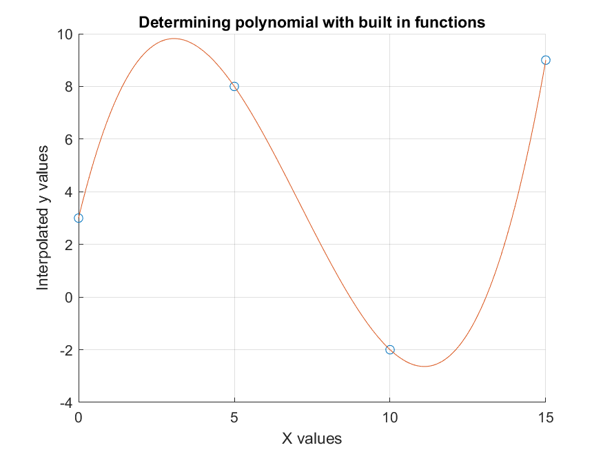
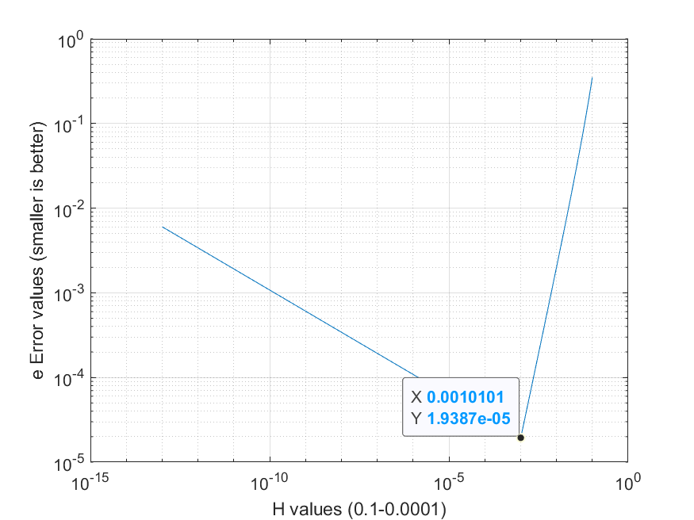
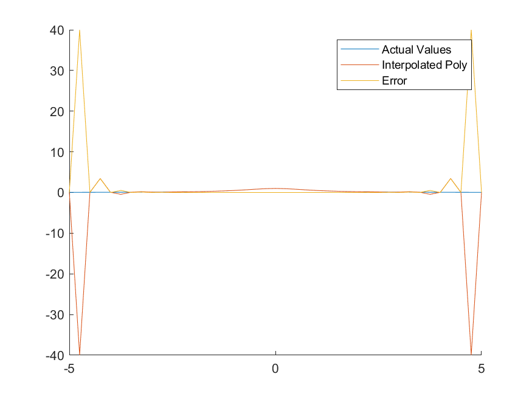
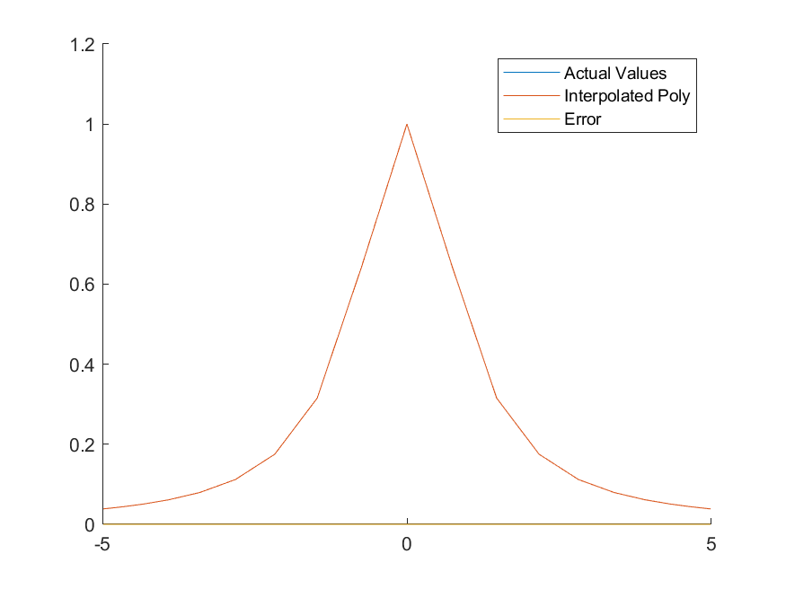

```{r include = FALSE}
# refresh environment
rm(list = ls())
library(dplyr) # utility package for tidyverse
library(tidyverse)
```

# Problem 1

Consider the polynomial interpolation for the following data points:

$$
\begin{tabular}{c|c|c|c|}
x & 1 & 2 & 3\\
y & 3 & 4 & 5
\end{tabular}
$$

## a. Write down the linear system in matrix form for solving the coefficients a~i~ of the polynomial p~n~(x).

$$
\left(\begin{array}{ccc} 
1 & 1 & 1\\
4 & 2 & 1\\
9 & 3 & 1 
\end{array}\right)
\left(\begin{array}{c} 
a_2 \\
a_1 \\
a_0
\end{array}\right) =
\left(\begin{array}{c}
3 \\
4 \\
5
\end{array}\right)
$$

## b. Use the lagrange interpolation process to obtain a polynomial to approximate these data points.

First let's define some cardinal functions:

\[I_0(x)=\frac{(x - x_1)(x-x_2)}{(x_0-x_1)(x_0-x_2)}=\frac{(x-2)(x-3)}{(1-2)(1-3)}=\frac{(x-2)(x-3)}{2}=\frac12(x-2)(x-3)\]
\[I_1(x)=\frac{(x - x_0)(x-x_2)}{(x_1-x_0)(x_1-x_2)}=\frac{(x-1)(x-3)}{(2-1)(2-3)}=\frac{(x-1)(x-3)}{-1}=-(x-1)(x-3)\]
\[I_2(x)=\frac{(x - x_0)(x-x_1)}{(x_2-x_0)(x_2-x_1)}=\frac{(x-1)(x-2)}{(3-1)(3-2)}=\frac{(x-1)(x-2)}{2}=\frac12(x-1)(x-2)\]

Then plug our cardinal functions into the equation:

\[P_2(x)=I_0(x)y_0+I_1(x)y_1+I_2(x)y_2 = 3*(\frac12(x-2)(x-3)) + 4*(-(x-1)(x-3)) + 5*(\frac12(x-1)(x-2))\]
\[P_2(x) = \frac32(x^2-5x+6)-4(x^2-4x+3)+\frac52(x^2-3x+2)\]
\[P_2(x) = \frac32x^2-4x^2+\frac52x^2-15x+16x+9-12+5\]
\[P_2(x) = x+2\]

Which is a polynomial that does in fact contain all of our given data points!

# Problem 2


## a. Use the Lagrange interpolation process to obtain a polynomial of least degree that assumes these values

$$
\begin{tabular}{c|c|c|c|c|}
x & 0 & 2 & 3 & 4\\
y & 7 & 11 & 28 & 63
\end{tabular}
$$

First let's define some cardinal functions.

\[I_0(x) = \frac{(x-x_1)(x-x_2)(x-x_3)}{(x_0-x_1)(x_0-x_2)(x_0-x_3)}=\frac{(x-2)(x-3)(x-4)}{(0-2)(0-3)(0-4)}=\frac{(x-2)(x-3)(x-4)}{-24}\]
\[I_1(x)=\frac{(x-x_0)(x-x_2)(x-x_3)}{(x_1-x_0)(x_1-x_2)(x_1-x_3)}=\frac{(x-0)(x-3)(x-4)}{(2-0)(2-3)(2-4)}=\frac{x(x-3)(x-4)}{4}\]
\[I_2(x)=\frac{(x-x_0)(x-x_1)(x-x_3)}{(x_2-x_0)(x_2-x_1)(x_2-x_3)}=\frac{(x-0)(x-2)(x-4)}{(3-0)(3-2)(3-4)}=\frac{x(x-2)(x-4)}{-3}\]
\[I_3(x)=\frac{(x-x_0)(x-x_1)(x-x_2)}{(x_3-x_0)(x_3-x_1)(x_3-x_2)}=\frac{(x-0)(x-2)(x-3)}{(4-0)(4-2)(4-3)}=\frac{x(x-2)(x-3)}{8}\]

Then plug our cardinal functions into the equation:

\[P_3(x)=I_0(x)y_0+I_1(x)y_1+I_2(x)y_2+I_3(x)y_3\]
\[P_3(x)=7*(\frac{(x-2)(x-3)(x-4)}{-24}) + 11*(\frac{x(x-3)(x-4)}{4}) + 28*(\frac{x(x-2)(x-4)}{-3}) + 63*(\frac{x(x-2)(x-3)}{8})\]
\[P_3(x)=\frac{-7}{24}(x^3-9x^2+26x-24)+\frac{11}4(x^3-7x^2+12x)+\frac{-28}3(x^3-6x^2+8x)+\frac{63}8(x^3-5x^2+6x)\]
\[P_3(x)=\frac{-7}{24}x^3+\frac{11}4x^3-\frac{28}3x^3+\frac{63}8x^3+\frac{63}{24}x^2-\frac{77}4x^2+\frac{168}3x^2-\frac{315}8x^2-\frac{182}{24}x+\frac{132}4x-\frac{224}3x+\frac{378}8x+7\]
\[P_3(x)=x^3-2x+7\]

And this polynomial includes all of our sample points!

## b. For the points in the previous table, find the Newton's form of the interpolating polynomial. Show that the two polynomials obtained are identical, although their forms may differ.

The general equation for n = 3:

\[P_3(x) = a_0 + a_1(x-x_0) + a_2(x-x_0)(x-x_1)+a_3(x-x_0)(x-x_1)(x-x_2)\]

Then let's calculate the coefficients using our triangular matrix:

$$
\begin{tabular}{c|c|c|c|c|}
0 & 7 \\
2 & 11 & 2\\
3 & 28 & 17 & 5\\
4 & 63 & 35 & 9 & 1\\
\end{tabular}
$$

Which results in the polynomial:

\[P_3(x) = 7 + 2x + 5x(x-2)+x(x-2)(x-3)\]
\[P_3(x) = x^3-2x+7\]

This is identical to the simplified polynomial in step a!

## c. The polynomial $p(x) = x^4 - x^3 + x^2 - x + 1$ has the values shown

$$
\begin{tabular}{c|c|c|c|c|c|c|}
x & -2 & -1 & 0 & 1 & 2 & 3 \\
p(x) & 31 & 5 & 1 & 1 & 11 & 61
\end{tabular}
$$

Find a polynomial q(x) that takes the same values (you don't need to expand it):

If we proceed with Lagrange form, then we can start with cardinal functions.

\[I_0(x) = \frac{(x+1)x(x-1)(x-2)(x-3)}{(-2+1)(-2)(-2-1)(-2-2)(-2-3)}=\frac{-1}{120}x(x+1)(x-1)(x-2)(x-3)\]
\[I_1(x) = \frac{(x+2)x(x-1)(x-2)(x-3)}{(-1+2)(-1)(-1-1)(-1-2)(-1-3)}=\frac{1}{24}x(x+2)(x-1)(x-2)(x-3)\]
\[I_2(x) = \frac{(x+2)(x+1)(x-1)(x-2)(x-3)}{(0+2)(0+1)(0-1)(0-2)(0-3)}=\frac{-1}{12}(x+2)(x+1)(x-1)(x-2)(x-3)\]
\[I_3(x) = \frac{x(x+2)(x+1)(x-2)(x-3)}{(1+2)(1+1)(1)(1-2)(1-3)}=\frac{1}{12}x(x+2)(x+1)(x-2)(x-3)\]
\[I_4(x) = \frac{x(x+2)(x+1)(x-1)(x-3)}{(2+2)(2+1)(2)(2-1)(2-3)}=\frac{-1}{24}x(x+2)(x+1)(x-1)(x-3)\]
\[I_5(x) = \frac{x(x+2)(x+1)(x-1)(x-2)}{(3+2)(3+1)(3)(3-1)(3-2)}=\frac{1}{120}x(x+2)(x+1)(x-1)(x-2)\]

Then plug them into our polynomial:

\[P_5(x) = 31*(\frac{-1}{120}x(x+1)(x-1)(x-2)(x-3)) + 5*(\frac{1}{24}x(x+2)(x-1)(x-2)(x-3)) ...\]
\[+ \frac{-1}{12}(x+2)(x+1)(x-1)(x-2)(x-3) + \frac{1}{12}x(x+2)(x+1)(x-2)(x-3) + 11*(\frac{-1}{24}x(x+2)(x+1)(x-1)(x-3)) ...\]
\[+ 61*(\frac{1}{120}x(x+2)(x+1)(x-1)(x-2))\]


# Problem 3

We want to interpolate the following data points:

$$
\begin{tabular}{c|c|c|c|c|}
x$_i$ & 0 & 5 & 10 & 15 \\
y$_i$ & 3 & 8 & -2 & 9
\end{tabular}
$$


## a. Show that the coefficients to the interpolating polynomial can be found by solving:

$$
\left(\begin{array}{cccc} 
1&0&0&0\\
1&5&25&125\\
1&10&100&1000\\
1&15&225&3375
\end{array}\right)
\left(\begin{array}{c} 
a_0 \\
a_1 \\
a_2 \\
a_3
\end{array}\right) =
\left(\begin{array}{c}
3 \\
8 \\
-2 \\
9
\end{array}\right)
$$

We can then solve this system of equations in the matrices to find the four coefficients. First let's reduce the matrix.

$$
\left(\begin{array}{cccc} 
1&0&0&0\\
0&5&25&125\\
0&10&100&1000\\
0&15&225&3375
\end{array}\right)
\left(\begin{array}{c} 
a_0 \\
a_1 \\
a_2 \\
a_3
\end{array}\right) =
\left(\begin{array}{c}
3 \\
5 \\
-5 \\
6
\end{array}\right)
$$

$$
\left(\begin{array}{cccc} 
1&0&0&0\\
0&5&25&125\\
0&0&50&750\\
0&0&0&750
\end{array}\right)
\left(\begin{array}{c} 
a_0 \\
a_1 \\
a_2 \\
a_3
\end{array}\right) =
\left(\begin{array}{c}
3 \\
5 \\
-15 \\
36
\end{array}\right)
$$

$$
\left(\begin{array}{cccc} 
1&0&0&0\\
0&1&5&25\\
0&0&1&15\\
0&0&0&1
\end{array}\right)
\left(\begin{array}{c} 
a_0 \\
a_1 \\
a_2 \\
a_3
\end{array}\right) =
\left(\begin{array}{c}
3 \\
1 \\
\frac{-15}{50} \\
\frac{36}{750}
\end{array}\right)
$$

$$
\left(\begin{array}{cccc} 
1&0&0&0\\
0&1&0&-50\\
0&0&1&15\\
0&0&0&1
\end{array}\right)
\left(\begin{array}{c} 
a_0 \\
a_1 \\
a_2 \\
a_3
\end{array}\right) =
\left(\begin{array}{c}
3 \\
-\frac12 \\
\frac{-15}{50} \\
\frac{36}{750}
\end{array}\right)
$$

$$
\left(\begin{array}{cccc} 
1&0&0&0\\
0&1&0&0\\
0&0&1&0\\
0&0&0&1
\end{array}\right)
\left(\begin{array}{c} 
a_0 \\
a_1 \\
a_2 \\
a_3
\end{array}\right) =
\left(\begin{array}{c}
3 \\
4.9 \\
-1.02 \\
0.048
\end{array}\right)
$$

Which clearly gives us the correct coefficients for the polynomial we are to find in the next step. This matrix was set up using the third degree polynomial equations using the known x as inputs and known y as outputs.


## Solve the linear equation in matlab

My code:

```{}
% Script for Problem 3

% Setup our known points
x = [0 5 10 15];
y = [3 8 -2 9];
% degree of polynomial
n = 3;

% Calculate the polynomial
poly = polyfit(x, y, n);
disp(poly)

% Now plot the polynomial
% Create the x values
xVals = 0:0.1:15;
yVals = poly(1)*xVals.^3+ poly(2)*xVals.^2+poly(3)*xVals+poly(4);

figure;
scatter(x,y);
hold on
plot(xVals,yVals)
grid on
xlabel('X values')
ylabel('Interpolated y values')
title('Determining polynomial with built in functions')
```

Coefficient output:

problem3Script

>> 0.0480   -1.0200    4.9000    3.0000

Plot output is figure 1.



# Problem 4

Let the function f(x) be three times differentiable. Consider the finite difference approximation formula:

\[f'(x) \approx D_h(x) = \frac1{2h}[-3f(x) + 4f(x+h) - f(x+2h)]\]

Note that this scheme uses values of f at the three points, x, x + h, and x + 2h. This is a one-sided finite difference.

## a. Using Taylor series, show that the local truncation error is bounded by Ch^2 for some constant C

Show: $|f'(x) - D_h(x)| \leq Ch^2$

* Error term for f(x): $E_{n+1} = \Sigma\frac1{k!}f^{(k)}(c)(x-c)^k$
* Error term for f(x+h): $E_{n+1} = \Sigma\frac1{k!}f^{(k)}(x)h^k$
* Error term for f(x+2h): $E_{n+1} = \Sigma\frac1{k!}f^{(k)}(x)(2h)^k$

And for each series we get:

\[f(x)=f(c)+(x-c)f'(c)+\frac12(x-c)^2f''(c)+\frac16(x-c)^3f'''(c)+O(h^4)\]
\[f(x+h)=f(x)+hf'(x)+\frac12h^2f''(x)+\frac16h^3f'''(x)+O(h^4)\]
\[f(x+2h)=f(x)+2hf'(x)+\frac124h^2f''(x)+\frac168h^3f'''(x)+O(h^4)\]

Then we plug them into our approximation formula to get:

\[\frac1{2h}[-3f(x) + 4f(x+h) - f(x+2h)] = -2f(x)+f(c)+(x-c)f'(c)+\frac12(x-c)^2f''(c)+\frac16(x-c)^3f'''(c)+8(\frac14f(x)+hf'(x)+\frac12hf''(x)+O(h^2))\]

Which means it is second order and therefore bounded by $Ch^2$

## b. Sharpen the error estimae

Show $|f'(x) - D_h(x)| = \frac13h^2f'''(\xi)$ for some $\xi \in [x,x+2h]$

We are on the interval [x, x+2h], wtih n = 2, x~0~ = x, x~1~ = x+ h, and x~2~ = x + 2h.

From the Interpolation Error theorem we have:

\[e(x) = \frac13f^3(\xi)|x-x)(x-(x+h))(x-(x+2h))|\]
\[|f'(x) - D_h(x)|  = \frac13f'''(x)h^2\]

## c.

Now set f(x) = tan(x). Use the formula to approximate the derivative f'(x) at x = 1.0, choosing h = 0.1, then h = 0.01, then h =0.001. Compare with the exact value to get the errors. Comment on your results. Are these errors consistent with the error estimate in a?

\[f'(x) \approx \frac1{2h}[-3f(x) + 4f(x+h) - f(x+2h)] = \frac1{2h}[-3tan(1) + 4tan(1+h) - tan(1+2h)]\]
\[D_{0.1}(x) = \frac1{0.2}[-3tan(1) + 4tan(1.1) - tan(1.2)] = 5(-4.672223174 + 7.859038629 - 2.572151622)=3.073319154\]
\[D_{0.01}(x) = \frac1{0.02}[-3tan(1) + 4tan(1.01) - tan(1.02)] = 3.423525535\]
\[D_{0.001}(x) = \frac1{0.002}[-3tan(1) + 4tan(1.001) - tan(1.002)]= 3.42549982\]

The exact value f'(1) for f(x) = tan(x) is sec^2^(1) = 3.425518821

Which results in the following errors:

* h=0.1, Error = 0.352199667
* h=0.01, Error = 0.001993286
* h=0.001, Error = 0.000019001

As expected, as you base the approximation off a smaller distance from x, the error gets smaller and smaller. Previously we stated that the error should be bounded by some value Ch^2. Respectively the bounds would be C(0.01), C(0.0001), and C(0.000001). For this to hold true we would expect the constant C to be on some magnitude of 100, since the errors we got were 2 decimals places too big.

## d. 

Use Matlab to compute the approximation of the drivative of tan(x) at x = 1.0, with the formula above, for smaller and smaller values of h. Plot the error e as a function of h, and use the log scaled. How did you expect the error to behave? How does the actual error behave? For what h value do you get the best results? What do you think is the cause of this behavior?

Script:

```{}
% Create the function to approximate the derivative

% Create the h values and find the actual value
h = linspace(0.0001,0.1);
vals = (1 ./ (2 .* h)).*(-3 .* tan(1) + 4 .* tan(1 + h) - tan(1 + 2.*h));
act = (sec(1))^2;


errors = abs(act - vals);

figure
loglog(h, errors)
grid on
xlabel('H values (0.1-0.0001)')
ylabel('e Error values (smaller is better)')
```

This yielded the following plot in figure 2.



As expected the smaller the h value, the smaller the error, but the computer starts to have
significance errors once it gets too small (at least that is my guess). The ebst value for my plot
was an h value of 0.0010101.

# Problem 5

Consider the finite difference approxmiation that we used in the previous problem. For f(x) = e^x^ at the point x = 1. Using the matlab function NumDerErr.m to fill in the table. Then compute the convergence order based on the formula:

\[order = log_2(\frac{Err_h}{Err_{h/2}})\]

$$
\begin{tabular}{|c|c|c|c|}
h & Err$_h$ & Err$_{h/2}$ & order \\
0.2 & 0.0422 & 0.0098 & 2.10639\\
0.02 & 0.0003679252 & 0.0000912921 & 2.01085\\
0.002 & 0.0000036298179 & 0.000000906775576 & 2.00108\\
0.0002 & 0.000000036253477 & 0.00000000906966679 & 1.998998
\end{tabular}
$$

# Problem 6

## a.

Write two functions in Matlab. The first function, called divdiff, should read in two vectors x and y, and return a matrix of the divided difference values. This means, the first few lines of your divdiff.m file should be:

```{}
function a=divdiff(x,y)
% input: x,y: the data set to be interpolated
% output: a: table for Newton’s divided differences.
```

The second function, called polyvalue, should read in the table of divided difference values generated by the function divdiff, the x-vector, and a vector t. The output of the function are the values of Netwon's polynomial computed at points given in the vector t. This means, your file polyvalue.m should start with the following few lines:

```{}
function v=polyvalue(a,x,t)
% input: a= Newton’s divided differences
% x= the points for the data set to interpolate,
% same as in divdiff.
% t= the points where the polynomial should be evaluated
% output: v= value of polynomial at the points in t
```

Here are the functions:

```{}
function a=divdiff(x,y)
% input: x,y: the data set to be interpolated
% output: a: table for Newton’s divided differences.
    
    [p, m] = size(x); % m points, polynomial order <= m-1
    if p ~= 1 || p ~=size(y, 1) || m ~= size(y, 2)
        error('divdiff: input vectors must have the same dimension'); 
    end
    a = zeros(m, m);
    a(:, 1) = y';
    for j = 2 : m
        for i = 1 : (m - j + 1)
            a(i,j) = (a(i + 1, j - 1) - a(i, j - 1)) / (x(i + j - 1) - x(i));
        end
    end
end


function v=polyvalue(a,x,t)
% input: a= Newton’s divided differences
% x= the points for the data set to interpolate,
% same as in divdiff.
% t= the points where the polynomial should be evaluated
% output: v= value of polynomial at the points in t
dims = size(a);
coeffs = a(1,:);

    function val = calcValue(z)
        val = 0;
        for term = 1:length(coeffs)
            newProd = coeffs(term);
            for termNum = 1:(term-1)
                if term == 1
                    break
                else
                    newProd = newProd * (z - x(termNum));
                end
            end
            val = val + newProd;
        end
        disp(val)
    end

v = zeros(size(t));

for i = 1:length(t)
   v(i) = calcValue(t(i)); 
end
end
```

## b.

Here you can test your Matlab functions in (a).

My script is:

```{}
% Create 21 equally spaced nodes
x = linspace(-5,5,21);
y = (x.^2+1).^(-1);

% Find the polynomial
% Get newtons's diff table
a = divdiff(x, y);

% 41 points to graph
xVal = linspace(-5,5,41);
yVal = (xVal.^2+1).^(-1);
newVal = polyvalue(a,x,xVal);
errorVal = abs(yVal-newVal);

figure
hold on
plot(xVal,yVal);
plot(xVal,newVal);
plot(xVal,errorVal);
legend('Actual Values','Interpolated Poly','Error')
```

Which results in figure 3:



You can see there are large errors right near -5 and 5, but the polynomial did a great job of following the function near the origin. Unlike with Chebyshev nodes, when you have a uniform distribution, your interpolating error can be any size between each node, but they are consistent in Chebyshev nodes, so you will not see this big spike.

# c. 

```{}
% Now we use chebyshev nodes
xOne = zeros(1,21);
xTwo = zeros(1,21);
for i = 0:20
    xOne(i+1) = 5*cos(i * pi / 20);
    xTwo(i+1) = 5*cos((2*i + 1)* pi / 42);
end
yOne = (xOne.^2+1).^(-1);
yTwo = (xTwo.^2+1).^(-1);

% Find the polynomial
% Get newtons's diff table
aOne = divdiff(xOne, yOne);
aTwo = divdiff(xTwo, yTwo);

newOne = polyvalue(aOne,xOne,xOne);
errorOne = abs(yOne-newOne);

newTwo = polyvalue(aTwo,xTwo,xTwo);
errorTwo = abs(yTwo-newTwo);

figure
disp(errorOne)
disp(errorTwo)
hold on
plot(xOne,yOne);
plot(xOne,newOne);
plot(xOne,errorOne);
legend('Actual Values','Interpolated Poly','Error')

hold off
figure
hold on
plot(xTwo,yTwo);
plot(xTwo,newTwo);
plot(xTwo,errorTwo);
legend('Actual Values','Interpolated Poly','Error')
```


With the chebyshev nodes the error values are minimized and spread out, so the polynomial fits the function very well. There is almost no error, so you cannot see the difference between the polynomial and the actual function on the graph.

See type one nodes in figure 4 and type two in figure 5:





