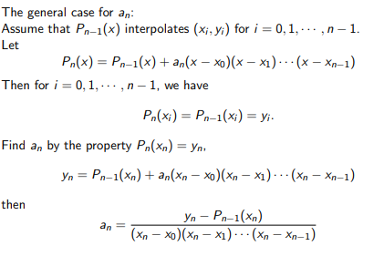
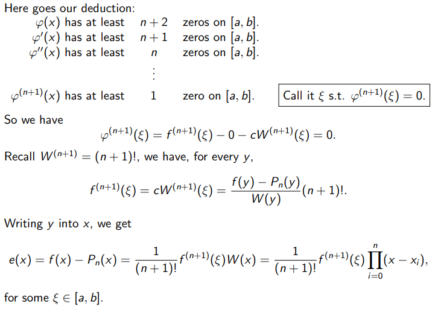

```{r include = FALSE}
# refresh environment
rm(list = ls())
library(dplyr) # utility package for tidyverse
library(tidyverse)
```

# Polynomial Interpolation

In this chapter we study how to interpolate a data set with a polynomial.

**Problem Description**: Given (n+1) points, say(x~i~, y~i~), where i = 0,1,2,...,n, with distinct
x~i~, not necessarily sorted, we want to find a polynomial of degree n:

\[
P_n(x) = a_nx^n + a_{n-1}x^{n-1}+...+a_1x+a_0
\]

such that it interpolates these points, i.e.,

\[
P_n(x)= y_i, i = 0,1,2,...,n
\]

The goal is the determine the coefficients $a_n, a_{n-1},...,a_1,a_0$. Note the total number of data poitns
is 1 larger than the degree of the polynomial.

Why should we do this?

* Find the values between the points for discrete data set
* To approximate a (probably complicated) function by a polynomial
* Then, it is easier to do computations such as derivative, integrations, etc...

## Van Der Monde Matrix Example

Interpolate the given data set with a polynomial of degree 2:

$$
\begin{tabular}{c|c|c|c|}
x$_i$ & 0 & 1 & 2/3\\
y$_i$ & 1 & 0 & 0.5
\end{tabular}
$$

**Answer** Let

\[
P_2(x) = a_2x^2 + a_1x+ a_0
\]

We need to find the coefficients $a_2, a_1, a_0$.
By the interpolating properties, we have 3 equations:

\[x = 0, y = 1 : P_2(0) = a_0 = 1\]
\[x = 1, y = 0 : P_2(1) = a_2+a_1+a_0 = 0\]
\[x = \frac23, y = 0.5 : P_2(\frac23) = (\frac49)a_2+(\frac23)a_1+a_0=0.5\]

Here we have 3 linear equations and 3 unknowns ($a_2, a_1, a_0$).


The equations:

\[a_0 = 1\]
\[a_2 + a_1 = 0\]
\[\frac49a_2+\frac23a_1+a_0=0.5\]

In matrix-vector form:

$$
\left(\begin{array}{ccc} 
0 & 0 & 1\\
1 & 1 & 1\\
\frac49 & \frac23 & 1
\end{array}\right)
\left(\begin{array}{c} 
a_0 \\
a_1 \\
a_2
\end{array}\right) =
\left(\begin{array}{c}
1 \\
0 \\
0.5
\end{array}\right)
$$

Easy to solve in Matlab, or do it by hand:

\[a_2 = -\frac34\]
\[a_1 = -\frac14\]
\[a_0 = 1\]

Then

\[P_2(x) = -\frac34x^2 -\frac14x + 1\]

### The general case


* X: a (n+1) x (n+1) matrix, given (Van Der Monde matrix)
* a: unknown vector, with length (n + 1)
* y: given vector, with length (n + 1)

**Theorem** If x~i~'s are distinct, then X is invertible, therefore a has a unique solution.

In Matlab, the command vander(x), where x is a vector that contains the interpolation points
x = [$x_1, x_2, ...,x_n$], will generate this matrix.

Bad News: X has a very large condition number for large n, therefore not effective to solve if n is large.

## Lagrange Form

Given points: $x_0,x_1,...,x_n$

Define the **cardinal functions** $I_0,I_1,...,I_n:\in P^n$, satisfying the properties


Here $\delta_{ij}$ is called the Kronecker's delta.

Locally supported in discrete sense. The cardinal functions I_i(x) can be written as:


Lagrange form of the interpolation polynomial can be simply expressed as 

\[P_n(x) = \Sigma I_j(x) * y_i\]

It is easy to check the interpolating property:

\[P_n(x_j) = \Sigma I_i(x_j) * y_i = y_j\]

for every j. (The cardinal function is 1 at x~i~, so y~i~ is multiplied by 1).

**Example 2** Write the Lagrange polynomial for the data

$$
\begin{tabular}{c|c|c|c|}
x$_i$ & 0 & 1 & 2/3\\
y$_i$ & 1 & 0 & 0.5
\end{tabular}
$$

**Answer** We first ocmpute the cardinal functions

\[I_0(x) = \frac{(x-x_1)(x-x_2)}{(x_0-x_1)(x_0-x_2)} = \frac{(x-2/3)(x-1)}{(0-2/3)(0-1)} = \frac32(x - \frac23)(x-1)\]
\[I_1(x) = \frac{(x-x_0)(x-x_2)}{(x_1-x_0)(x_1-x_2)} = \frac{(x-0)(x-1)}{(2/3-0)(2/3-1)} = -\frac92x(x-1) \]
\[I_2(x) = \frac{(x-x_0)(x-x_1)}{(x_2-x_0)(x_2-x_1)} = \frac{(x-0)(x-2/3)}{(1-0)(1-2/3)} = 2x(x-\frac23) \]

so

\[P_2(x) = I_0(x)y_0+I_1(x)y_1+I_2(x)y_2 = \frac32(x - \frac23)(x-1) -\frac92x(x-1)(0.5) + 0 = -\frac34x^2-\frac14+1\]

Pros and cons of Lagrange polynomial:

* (+) Elegant Formula
* (-) Slow to compute, since each cardinal function is different
* (-) Not flexible: if one changes a point x~j~, or add on an additional point x~n+1~, one must recompute all cardinal functions.

## Newton's divided differences

Given a data set:

$$
\begin{tabular}{c|c|c|c|c|}
x$_i$ & x$_0$ & x$_1$ & ... & x$_n$\\
y$_i$ & y$_0$ & y$_1$ & ... & y$_n$
\end{tabular}
$$

We will describe an algorithm in a recursive form.

**Main idea:**

Given $P_k(x)$ that interpolates k + 1 data points {$x_i, y_i$}, i = 0,1,2,...,k,
compute $P_{k+1}(x)$ that interpolates one extra point, {$x_{k+1},y_{k+1}$}, by using P~k~ and adding an extra term

For n = 0, we set $P_0(x) = y_0$. Then $P_0(x_0) = y_0$.

For n = 1, we set

\[P_1(x) = P_0(x) + a_1(x - x_0)\]

where a~1~ is to be determined.

Then, $P_1(x_0) = P_0(x_0) + 0 = y_0$, for any a~1~.

Find a~1~ by the interpolation property $y_1 = P_1(x_1)$, we have

\[y_1 = P_0(x_1) +a_1(x_1-x_0)=y+0+a_1(x_1-x_0)\]

This gives us 

\[a_1 = \frac{y_1 - y_0}{x_1-x_0}\]

For n = 2, we set

\[P_2(x) = P_1(x) + a_2(x-x_0)(x-x_1)\]

Then $P_2(x_0) = P_1(x_0) = y_0, P_2(x_1) = P_1(x_1) = y_1$.

Determine a~2~ by the interpolation property $y_2 = P_2(x_2)$

\[y_2 = P_1(x_2) + a_2(x_2 - x_0)(x_2-x_1)\]

Then

\[a_2 = \frac{y_2 - P_1(x_2)}{(x_2-x_0)(x_2-x_1)}\]

We would like to express a~2~ in a different way. Recall

\[P_1(x) = y_0 + \frac{y_1-y_0}{x_1-x_0}(x - x_0)\]

Then 

\[P_1(x_2) = y_0 + \frac{y_1-y_0}{x_1-x_0}(x_2 - x_0)\]
\[P_1(x_2) = y_0 + \frac{y_1-y_0}{x_1-x_0}(x_2 - x_1) + \frac{y_1-y_0}{x_1-x_0}(x_1 - x_0)\]
\[P_1(x_2) = y_1 + \frac{y_1-y_0}{x_1-x_0}(x_2 - x_1)\]

Then a~2~ can be rewritten as

\[a_2 = \frac{y_2 - {P_1(x_2)}}{(x_2-x_0)(x_2-x_1)} = \frac{y_2-y_1-\frac{y_1-y_0}{x_1-x_0}(x_2-x_1)}{(x_2-x_0)(x_2-x_1)}=\frac{\frac{y_2-y_1}{x_2-x_1}-\frac{y_1-y_0}{x_1-x_0}}{x_2-x_0}\]


(Rise over the run? Secant lines represented...)

\[a_2 \approx \frac{f'(x_2)-f'(x_0)}{x_2-x_0} \approx f''()\]

and a_1 is an approximate first derivative.

### The general case:




Newton's form for the interpolation polynomial:

\[P_n(x) = a_0 + a_1(x - x_0) + a_2(x-x_0)(x-x_1)+...+a_n(x-x_0)(x-x_1)...(x-x_{n-1})\]


### Recursive Computation

The recursion is initiated with

\[f[x_i] = y_i, i = 0,1,2,...\]

Then 

\[f[x_0,x_1] = \frac{f[x_1]-f[x_0]}{x_1-x_0}\]
\[f[x_1,x_2] = \frac{f[x_2]-f[x_1]}{x_2-x_1}\]
\[f[x_0,x_1,x_2] = \frac{f[x_1,x_2]-f[x_1,x_0]}{x_2-x_0}\]
\[f[x_0,x_1,x_2] = \frac{f[x_3,x_2]-f[x_2,x_1]}{x_3-x_1}\]

For the general step we have

\[f[x_0,x_1,...,x_k] = \frac{f[x_1,x_2,...,x_k] - f[x_0,x1_...,x_{k-1}]}{x_k-x_0}\]

The constants a~k~'s in the Newton's form are computed as

\[a_0 = f[x_0]\]
\[a_1 = f[x_0,x_1]\]
\[...\]
\[a_k = f[x_0,x_1,...,x_k]\]

We compute f[...]'s through the following table:


The diagonal elements give us the coefficients a~i~'s

### Example

Write Newton's form of interpolation polynomial for the data

$$
\begin{tabular}{c||c|c|c|c|}
x$_i$ & 0 & 1 & 2/3 & 1/3\\
y$_i$ & 1 & 0 & 1/2 & 0.866
\end{tabular}
$$

**Answer** Set up the triangular table for computation

$$
\begin{tabular}{c||c|c|c|c|}
0 & 1 & & & \\
1 & 0 & -1 & & \\
2/3 & 0.5 & -1.5 & -0.75 & \\
1/3 & 0.8660 & -1.0981 & -0.6029 & 0.4413
\end{tabular}
$$

So we have

\[a_0 = 1, a_1 = -1, a_2 = -0.75, a_3 = 0.4413\]

Then

\[P_3(x) = 1 + -1x + -0.75x(x-1) + 0.4413x(x-1)x-\frac23)\]

**Flexibility** of Newton's form: easy to add additional points to interpolate.

### Nested form of Newton's Polynomial

\[P_n(x) = a_0 + a_1(x-x_0) + a_2(x-x_0)(x-x_1) + ...+a_n(x-x_0)(x-x_1)...(x-x_{n-1})\]
\[P_n(x) = a_0 + (x-x_0)(a_1 + (x-x_1)(a_2 + (x-x_2)(a_3 + ... + a_n(x-x_{n-1}))))\]

Effective coding:

Given the data x~i~ and a~i~ for i = 0,1,...,n the following pseudo-code evaluates Newton's Polynomial $p = P_n(x)$

* p = a~n~
* for k = n-1,n-2,...,0
    + p = p(x-x_k) + a_k
* end

This requires only 3n flops.

## Existence and Uniqueness theorem for polynomial interpolation

**Theorem (Fundamental Theorem of Algebra)**

Every polynomial of degree n that is not identically zero, has maximum n roots (including multiplicities).
These roots may be real or complex. In particular, this implies that if a polynomial of degree n has more than n roots,
then it must be identically zero.

**Theorem (Existence and Uniqueness of Polynomial Interpolation)**

Given (x~i~, y~i~), with x~i~'s distinct. There exists one and only one polynomial P~n~(x) of degree $\leq n$ such that 
$P_n(x_i) = y_i$ for i = 0,1,...,n.

**Proof**

The existence: by construction. Uniqueness: Assume we have two polynomials $p(x),q(x) \in P_n$, such that

\[p(x_i) = y_i\]
\[q(x_i) = y_i\]
\[i = 0,1,...,n\]

Now, let $g(x) = p(x) - q(x)$, a polynomial of degree $\leq n$.

\[g(x_i) = p(x_i) - q(x_i) = y_i - y_i = 0\]
\[i = 0,1,...,n\]

So g(x) has n+1 zeros. By the Fundamental Theorem of Algebra (max n roots), we must have g(x) = 0, therefore p(x) is
congruent to q(x).

# Errors in Polynomial Interpolation

Given a function f(x) on $x \in [a,b]$, and a set of distinct points $x_i \in [a,b]$,
i = 0,1,...,n. Let $P_n(x) \in P_n$ such that..

\[P_n(x_i) = f(x_i),i=0,1,..,n\]

Error function

\[e(x) = f(x) - P_n(x), x\in [a,b]\]

**Theorem**. There exists some value $\xi \in [a,b]$, such that

\[e(x) = \frac1{(n+1)!}\xi\Pi(x-x_i),x\in [a,b]\]

**Proof**

If $f \in P_n$, then by Uniqueness Theorem of polynomial interpolation we must have $f(x) = P_n(x)$.
Then e(x) == 0 and the proof is trivial.

Now assume $f \notin P_n(x)$. If $x=x_i$ for some i, we have $e(x_i) = f(x_i) - P_n(x_i) = 0$, and the results holds.

Now consider $x \neq x_i$ for any i.

\[W(x) = \Pi(x-x_i) \in P_{n+1}\]

it holds:

\[W(x_i) = 0\]
\[w(x) = x^{n+1}+...\]
\[W^{(n+1)} = (n+1)!\]

Fix a y such that $y \in [a,b]$ and $y \neq x_i$ for any i. We define a constant

\[c = \frac{f(y)-P_n(y)}{W(y)}\]

and another function

\[\phi(x) = f(x) - P_n(x) - cW(x)\]

We find all the zeros for $\phi(x)$. We see that x~i~'s are zeros since

\[\phi(x_i)=f(x_i)-P_n(x_i)-cW(x_i) = 0, i = 0,1,...,n\]

and also y is a zero because

\[\phi(y) = f(y) - P_n(y) -cW(y) = 0\]

So, $\phi$ has at least (n+2) zeros.




## Error fomula Example

Recall the error formula:

\[e(x) = \frac1{(n+1)!}\xi\Pi(x-x_i)\]

**Example** If n = 1, x~0~ = a, x~1~ = b, b > a, find an upper bound for error.

**Answer** Let

\[M = max|f''(x)| = ||f''(x)||_\infty\]

and observe

\[max|(x-a)(x-b)|=\frac{(b-a)^2}4\]

For $x \in [a,b]$, we have

\[|e(x)| = \frac12|f''(\xi)|*|(x-a)(x-b)| \leq \frac12||f''||_\infty\frac{(b-a)^2}4=\frac18||f''||_\infty(b-a)^2\]

Error depends on the distribution of nodes x~i~. If b is close to a, then we have a small error bound.


# Unifrom Grid

Equally distribute the nodes (x~i~): on [a,b], with n+1 nodes.

\[x_i = a + ih, h = \frac{b-a}n, i = 0,1,...,n\]

One can show that for $x \in [a,b]$, it holds

\[\Pi|x-x_i| \leq \frac14h^{n+1}*n!\]

**Proof** If x = x~i~ for some i, then x-x~i~ = 0 and the product is zero, so it trivially holds.

Now assume x~i~ < x < x~i+1~. We have

\[max|(x-x_i)(x-x_{i+1}| = \frac14(x_{i+1}-x_i)^2=\frac{h^2}4\]

Now consider the other terms in the product, say x-x~j~, for either j > i + 1, or j < i. Then $|(x-x)j| \leq h(j-i)$ for j > i + 1 and 
$|(x-x)j| \leq h(i+1-j)$ for j < i. In all cases, the product of these terms are bounded by $h^{n-1}n!$, proving the result.

We have the error estimate

\[|e(x)| \leq \frac1{4(n+1)}|f^{(n+1)}(x)|h^{n+1}\leq\frac{M_{n+1}}{4(n+1)}h^{n+1}\]

where

\[M_{n+1} = max|f^{(n+1)}(x)|=||f^{(n+1)}||_\infty\]

**Example** Consider interpolating f(x) = sin($\pi$x) with polynomial on the interval [-1, 1] with uniform noes. Give an upper bound for error.

**Answer** Since

\[f'(x)=\pi cos \pi x\]
\[f''(x) = -\pi^2sin\pi x\]
\[f'''(x) = -pi^3cos\pi x\]

we have 

\[|f^{(n+1)}(x)| \leq \pi^{n+1},M_{n+1}=\pi^{n+1}\]

so the upper bound for error is

\[|e(x)| \leq \frac{M_{n+1}}{4(n+1)}h^{n+1} \leq \frac{\pi^{n+1}}{4(n+1)}(\frac2n)^{n+1}\]


Simulation Data:


# Chebychev nodes: equally distributing the error

Type I: including the end points.

For interval [-1,1]: $\overline x_i = cos(\frac{i}{n}\pi), i = 0,1,...,n$

For interval [a,b] : $\overline x_i = \frac12(a+b) + \frac12(b-a)cos(\frac{i}{n}\pi), i = 0,1,...,n$

One can show that:


where x~k~ is any other choice of nodes.

Error bound: $|e(x)| \leq \frac1{(n+1)!}|f^{(n+1)}(x)|2^{-n}$

**Example** Consider the same example with uniform nodes, $f(x) = sin\pi x$

With Chebyshev nodes, we have

\[|e(x)| \leq \frac1{(n+1)!}\pi^{n+1}2^{-n}\]

Now look at the much smaller error bounds!


Type II: Chebyshev nodes can be chosen strictly inside the interval (a,b):

\[\overline x_i = \frac12(a+b) + \frac12(b-a)cos(\frac{2i+1}{2n+2}\pi),i=0,1,...,n\]


# Discussion

For large n, polynomials are heavy to deal with.

In general, interpolation polynomials do not coverge as n gets closer to infinity.

For small intervals, the error with polynomial interpolation is small.

Conclusion: Better to use piecewise polynomial interpolation - next chapter (splines). This uses polynomials
of not so high power on smaller intervals.


