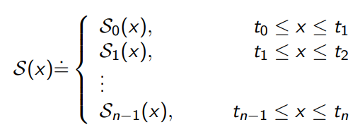
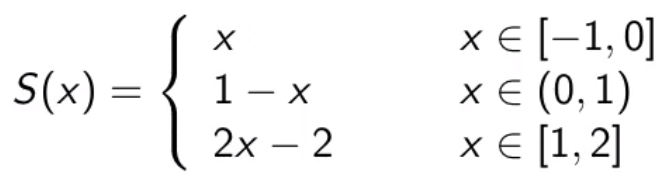
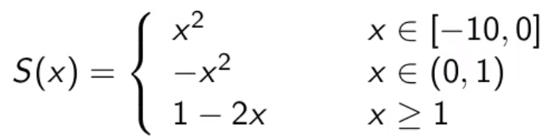
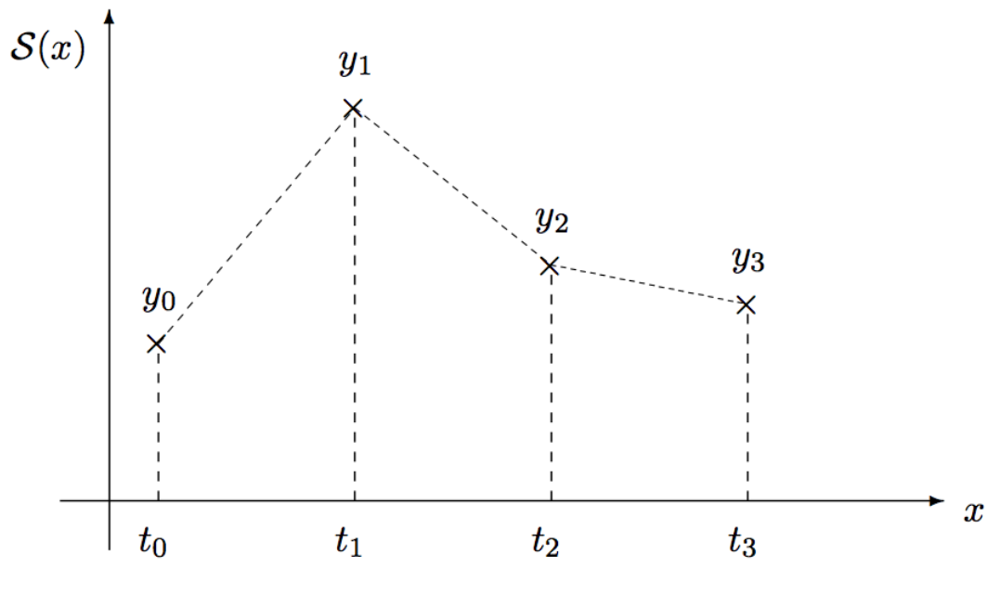
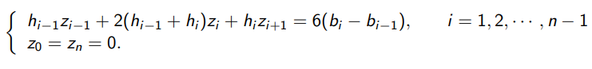
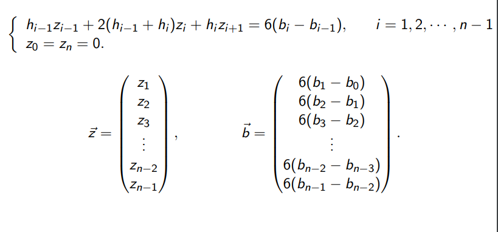
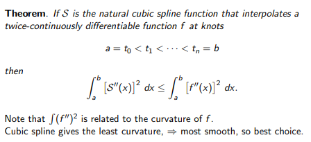
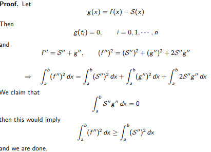
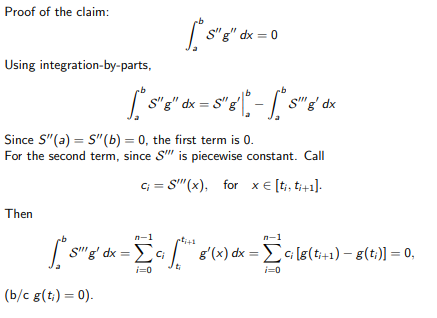

```{r include = FALSE}
# refresh environment
rm(list = ls())
library(dplyr) # utility package for tidyverse
library(tidyverse)
```


# Introduction

Disdvantages of Polynomial Interpolation $P_n(x)$:

* n-time differentiable. We do not need such high smoothness.
* big error in certain intervals (esp near the end points)
* There is no convergence results
* Heavy to compute for large n

Suggestion: use piecewise polynomial interpolation

Usage:

* Visualization of discrete data
* graphic design

Requirement:

* Interpolation
* certain degree of smoothness

# Problem Setting

Given a set of data

$$
\begin{tabular}{c|c|c|c|c}
x & t$_0$ & t$_1$ & ... & t$_n$\\
y & y$_0$ & y$_1$ & ... & y$_n$
\end{tabular}
$$

Find a function S(x) which interpolates points (t~i~, y~i~) for all i.

The set $t_0 < t_1 < ... < t_n$ are called knots. Note they need to be ordered.

S(x) consists of piecewise polynomials.



S(x) is called a spline of degree k, if 

* S~i~(x) is a polynomial of degree k
* S(x) is (k-1) times continuous differentiable i.e. for i = 1,2,...,k-1 we have:

\[S_{i-1}(t_i) = S_i(t_i)\]
\[S_{i-1}'(t_i) = S_i'(t_i)\]
...
\[S_{i-1}^{(k-1)}(t_i)=S_i^{(k-1)}(t_i)\]

Commonly used splines:

* n = 1: linear spline (simplest)
* n = 2: quadratic spline (less popular)
* n = 3: cubic spline (most used)

# Examples

Determine whether this function is a first-degree spline function.



**Answer** Check the properties of a linear spline.

* Linear polynomial for each piece - OK (degree 1 or less)
* S(x) is continuous at inner knots
* At x= 0, S(x) is discontinuous, because from the left we get 0 and from the right we get 1.

Therefore this is NOT linear spline.

Determine whether the following function is a quadratic spline.



**Answer** Let's label each piece:

\[Q_0(x) = x^2;Q_1(x) = -x^2;Q_2(x) = 1-2x\]

We now check all conditions. Let's check the continuity at the inner knots of Q and Q'.

\[Q_0(0) = 0 = Q_1(0)\]
\[Q_1(1) = -1 = Q_2(1)\]
\[Q_0'(0) = 0 = Q_1'(0)\]
\[Q_1'(1) = -2 = Q_2'(1)\]

Therefore, since all conditions pass, this IS a quadratic spline.


# Linear Spline

n = 1: piecewise linear interpolation, i.e., straight line between 2 neighboring points.



Requirements:

\[S_0(t_0) = y_0\]
\[S_{i-1}(t_i) = S_i(t_i) = y_i; i = 1,2,...,n-1\]
\[S_{n-1}(t_n) = y_n\]

Easy to find: write the equation for a line through two points $(t_i, y_i)$ and $(t_{i+1},y_{i+1})$

\[S_i(x) = y_i + \frac{y_{i+1}-y_i}{t_{i+1}-t_i}(x-t_i); i = 0,1,2,...,n-1\]

## Accuracy Theorem for linear spline

Assume $t_0 < t_1 < ... < t_n$ and let $h_i = t_{i+1}-t_i, h = max_ih_i$

f(x) is the given function and S(x) is the linear spline that interpolates the function such that

\[S(t_i) = f(t_i); i = 0,1,...,n\]

Then we have the following for $x \in [t_0, t_n]$

* If f'' exists and is continuous, then $|f(x) - S(x)| \leq \frac18h^2max_x|f''(x)|$
* If f' exists and is continous, then $|f(x) - S(x)| \leq \frac12hmax_x|f'(x)|$

To minimize error, it is obvious that one should add more knots where the function has large first or second derivative.

Since a quadratic spline is less used, please reference it within the book.


# Natural Cubic Spline

Given $t_0 < t_1 < ... < t_n$, we define the cubic spline with

\[S(x) = S_i(x); t_i \leq x \leq t_{i+1}\]

Write

\[S_i(x) = a_ix^3 + b_ix^2 + c_ix + d_i, i = 0,1,...,n-1\]

Total number of unknowns is 4 * n. Requirements are that S, S', S'' are all continuous.

Equations we have:

* $S_i(t_i) = y_i, i = 0,1,...,n-1$
* $S_i(t_{i+1}) = y_{i+1}, i = 0,1,...,n-1$
* $S_i'(t_{i+1}) = S_{i+1}'(t_{i+1}), i = 0,1,...,n-2$
* $S_i''(t_{i+1}) = S_{i+1}''(t_{i+1}), i = 0,1,...,n-2$

This gives us 4n-2 equations total, so we still need two more conditions.

* $S_0''(t_0) = 0, S_{n-1}''(t_n)=0$

These last two equations choice makes our spline a "natural" spline.

How to compute S~i~(x)? We know:

* S~i~ is polynomial degree 3
* S~i~' is degree 2
* S~i~'' is degree 1

Procedure

1. Start with S~i~''(x), they are all inear, one can use Lagrange form
2. Integrate S~i~''(x) twice to get S~i~(x), you will get 2 integration constant
3. Determine these constants. Various tricks on the way...

Define: $z_i = S''(t_i), i = 1,2,...,n-1, z_0=z_n=0$

These $z_i$'s are our unknowns.

Let h~i~ = t~i+1~ -t~i~. Lagrange form for S~i~''.

\[S_i''(x) = \frac{z_{i+1}}{h_i}(x-t_i)-\frac{z_i}{h_i}(x-t_{i+1})\]

Then 

\[S_i'(x) = \frac{z_{i+1}}{2h_i}(x-t_i)^2-\frac{z_i}{2h_i}(x-t_{i+1})^2+C_i-D_i\]
\[S_i(x) = \frac{z_{i+1}}{6h_i}(x-t_i)^3-\frac{z_{i+1}}{6h_i}(x-t_{i+1})^3+c_i(x-t_i)-D_i(x-t_{i+1})\]

You can check yourself that these two equations are correct.

Interpolating Properties: $S_i(t_i) = y_i$

\[y_i = -\frac{z_i}{6h_i}(-h_i)^3-D_i(-h_i)=\frac16z_ih_i^2+D_ih_i\]
\[D_i = \frac{y_i}{h_i}-\frac{h_i}6z_i\]

$S_i(t_{i+1}) = y_{i+1}$ gives

\[y_{i+1} = \frac{z_{i+1}}{6h_i}h_i^3+C_ih_i\]
\[C_i = \frac{y_{i+1}}{h_i}-\frac{h_i}6z_{i+1}\]

We see that, once z~i~'s are known, then (C~i~, D~i~)'s are known, and so are S~i~, S~i~' are known.

\[S_i(x)=\frac{z_{i+1}}{6h_i}(x-t_i)^3-\frac{z_i}{6h_i}(x-t_{i+1})^3+(\frac{y_{i+1}}{h_i}-\frac{h_i}6z_{i+1})(x-t_i)-(\frac{y_i}{h_i}-\frac{h_i}6z_i)(x-t_{i+1})\]
\[S_i'(x)=\frac{z_{i+1}}{2h_i}(x-t_i)^2-\frac{z_i}{2h_i}(x-t_{i+1})^2+\frac{y_{i+1}-y_i}{h_i}-\frac{z_{i+1}-z_i}{6}h_i\]


Continuity of S'(x) requires

\[S_{i-1}'(t_i)=S_i'(t_i), i =1,2,...,n-1\]
\[S_i'(t_i) = -\frac16h_iz_{i+1}-\frac13h_iz_i+b_i\]
\[S_{i-1}'(t_i)=\frac16z_{i-1}h_{i-1}+\frac13z_ih_{i-1}+b_{i-1}\]

Set them equal to each other and we get:






Summarizing the algorithm:

* Set up the matrix-vector equation and solve for z~i~
* Compute S_i(x) using these z~i~'s

See Matlab codes.

# Smoothness Theorem for natural splines








