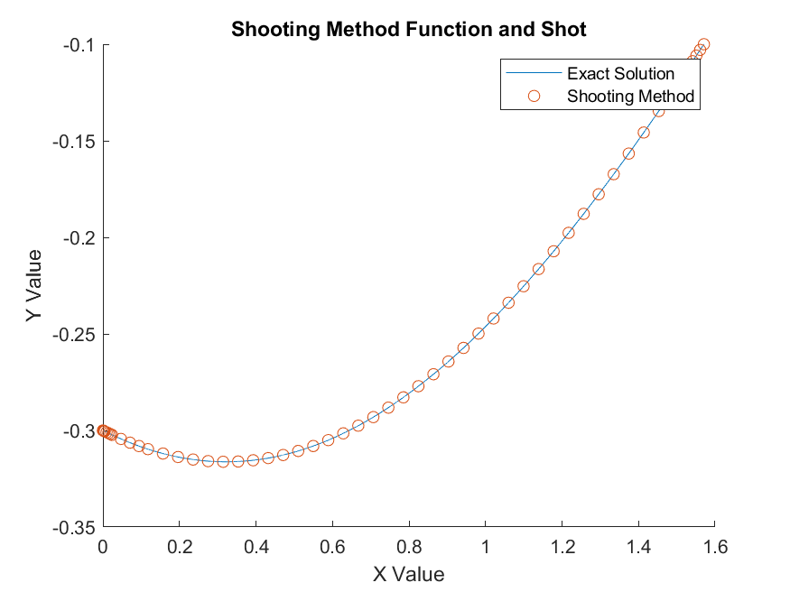
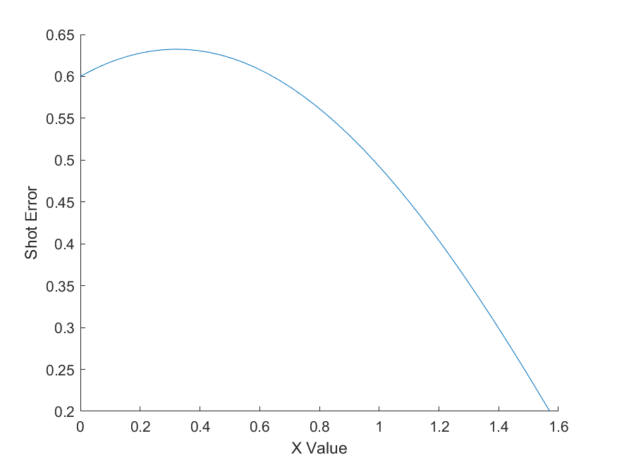
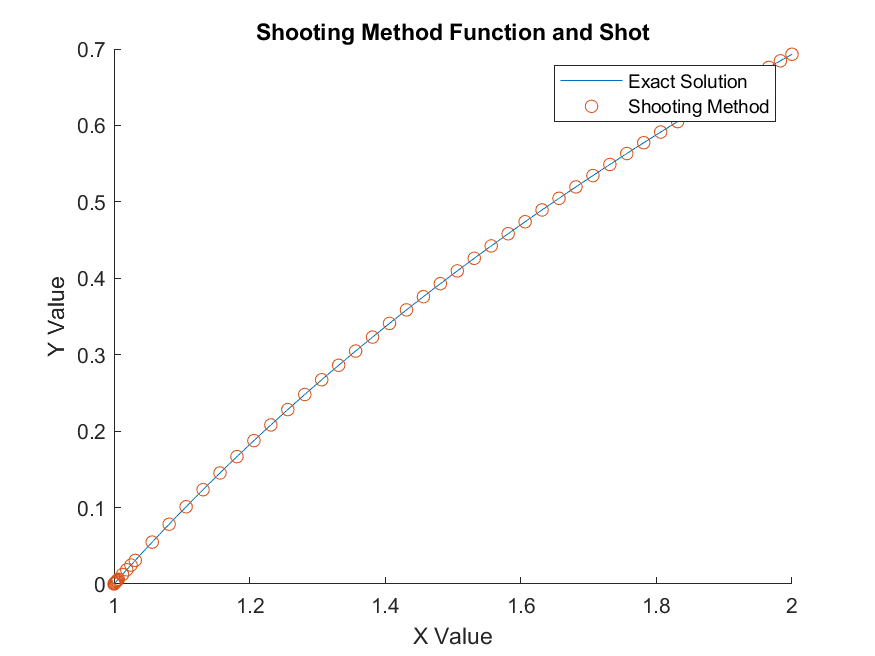
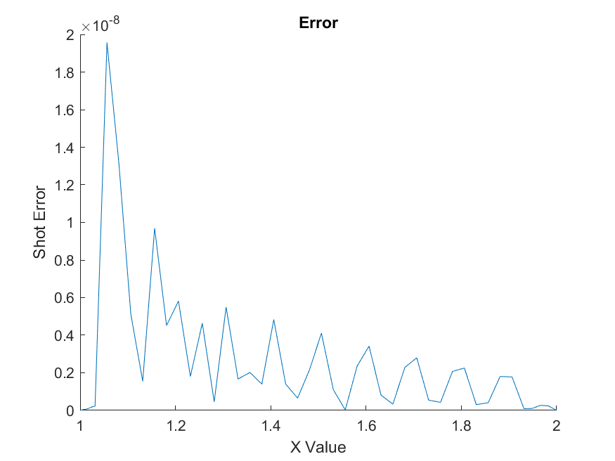
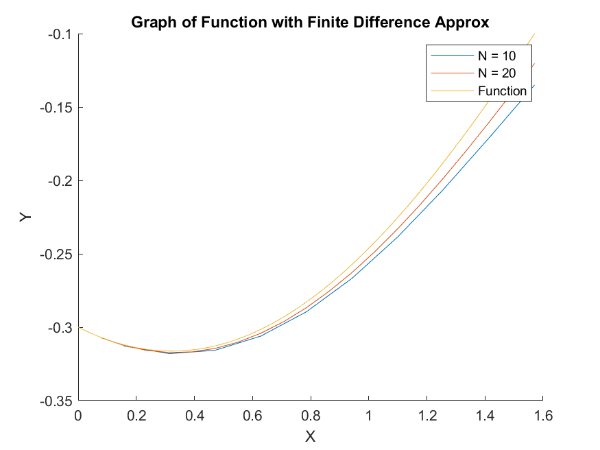
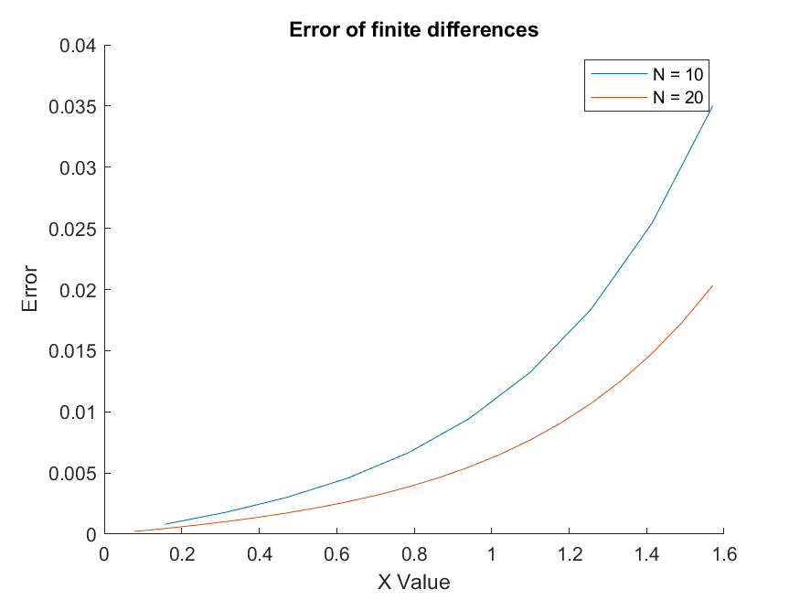

```{r include = FALSE}
# refresh environment
rm(list = ls())
library(dplyr) # utility package for tidyverse
library(tidyverse)
```

# Problem 1 Linear Shooting Method

## a.

Consider the differential equation:

\[y'' = y' + 2y + cos(x); 0 \leq x \leq \frac\pi2\]
\[y(0) = -0.3, y(\frac\pi2) = -0.1\]

Show that the exact solution is:

\[y(x) = -(sin(x)+3cos(x))/10\]

Implement the shooting method for this problem in Matlab. Use Matlab solver ode45, with your choice of error tolerance. You can check your answer by comparing it with the exact solution. Plot your solution, and also the error.

Script:

```{}
% Linear boundry value shooting method

% set initial values
tol = 10^-8;
alpha = -0.3;
beta = -0.1;
y = [alpha; -1; alpha; 10000];
nmax = 100;

% t is in the range 0 to pi / 2
tSpan = [0 pi / 2];
[t, yOut] = ode45(@odefun,tSpan,y);

n = 0;
testVal = 100000000000000;

while abs(testVal - beta) > tol && n < nmax
    % lat row num
    lastRow = length(yOut(:,1));
    % calculate lambda
    lambda = (beta - yOut(lastRow,3)) / (yOut(lastRow,1) - yOut(lastRow,3));
    disp(lambda)
    % get y(b)
    testVal = lambda * yOut(lastRow,1) + (1 - lambda) * yOut(lastRow,3);
    if abs(testVal - beta) < tol
        break
    end
    y(2) = lambda * y(2);
    y(4) = (1-lambda) * y(4);
    [t, yOut] = ode45(@odefun,tSpan,y);
    n = n + 1;
end
yOutput = lambda .* yOut(:,1) + (1 - lambda) .* yOut(:,3);
disp(yOut(lastRow,1))
disp(yOut(lastRow,3))
disp(testVal)

tFunc = [tSpan(1):0.0001:tSpan(2)];
yFunc = -1 .* (sin(tFunc) + 3 .* cos(tFunc))./10;

% Plot function
figure
hold on
plot(tFunc, yFunc)
scatter(t, yOutput)
xlabel("X Value")
ylabel("Y Value")
title("Shooting Method Function and Shot")
legend("Exact Solution", "Shooting Method")

% Plot error
yFuncErr = 1 .* (sin(t) + 3 .* cos(t))./10;
yFuncErr = abs(yOutput - yFuncErr);
figure
hold on
plot(t, yFuncErr)
xlabel("X Value")
ylabel("Shot Error")


function out=odefun(t,y)
    % system to solve
    out = zeros(4,1);
    out(1) = y(2);
    out(2) = y(2) + 2 * y(1) + cos(t);
    out(3) = y(4);
    out(4) = y(4) + 2 * y(3) + cos(t);
end
```

Plot is figure 1 and error plot is figure 2.






## b.

Consider the two-point boundary value problem for the unknown u(x):

\[u'' = 3u - x + x^2, u(0) = 0, u(1) + u'(1) = 1\]

Explain in detail how to solve this problem with the shooting method.

Using the previous boundary value problem we compared our soluation after using our ODE solver to the actual value of beta. Let us use that approach again. Before beta was a single value, but now beta is $1 - u'(1)$. In this instance u'(1) represents our value of the first derivative at the right endpoint.

\[\lambda y_1(b) + (1-\lambda)y_2(b) = \beta - \lambda y_1'(b) + (1-\lambda)y_2'(b)\]
\[\lambda y_1(b) + (1-\lambda)y_2(b) + \lambda y_1'(b) + (1-\lambda)y_2'(b) = \beta\]
\[\lambda (y_1(b) + y_1'(b)) + (1-\lambda)(y_2(b)+y_2'(b)) = \beta\]
\[\lambda = \frac{\beta - (y_2(b)+y_2'(b))}{(y_1(b) + y_1'(b)) - (y_2(b)+y_2'(b))}\]

With the new boundary we merely have to update the way that we find our value of lambda to ensure that this boundary condition stays true by incorporating the value of $u'(b)$.


# Problem 2

Consider the differential equation

\[y'' = -(y')^2 - y + ln(x), 1\leq x \leq 2\]
\[y(1) = 0, y(2) = ln(2)\]

Show that the exact solution is:

\[y(x) = ln(x)\]

Implement the shooting method for this problem in Matlab. Use the Matlab solver ode45. Note that this is a non-linear problem, so you need to use a secant iteration. Since the secant iteration converges quickly if the initial guess is good, it is crucial to get a good initial guess. Try the values $z_1 = 1, z_2 = 0.5$.

You may chooose the tolerance to be 10^-9, and maximum number of iterations for teh secant method to be 5. Plot the approximate solutions together with the exact solution. Plot also the error.

My Script:

```{}
% Non-Linear boundry value shooting method

% set initial values
tol = 10^-9;
alpha = 0;
beta = log(2);
z1 = 1;
z2 = 0.5;
y = [alpha; z1; alpha; z2];
nmax = 5;

% t is in the range 0 to pi / 2
tSpan = [1 2];
[t, yOut] = ode45(@odefun,tSpan,y);

n = 0;
testVal = 100000000000000;

while abs(testVal - beta) > tol && n < nmax
    % lat row num
    lastRow = length(yOut(:,1));
    % secant iteration
    testVal = z2 + (beta - yOut(lastRow,3))*((z2 - z1)/(yOut(lastRow,3)-yOut(lastRow,1)));
    if abs(testVal - beta) < tol
        break
    end
    % update z vals;
    z1 = z2;
    z2 = testVal;
    y(2) = z1;
    y(4) = z2;
    [t, yOut] = ode45(@odefun,tSpan,y);
    n = n + 1;
end
yOutput = lambda .* yOut(:,1) + (1 - lambda) .* yOut(:,3);
disp(yOut(lastRow,1))
disp(yOut(lastRow,3))
disp(testVal)

tFunc = [tSpan(1):0.0001:tSpan(2)];
yFunc = log(tFunc);

% Plot function
figure
hold on
plot(tFunc, yFunc)
scatter(t, yOutput)
xlabel("X Value")
ylabel("Y Value")
title("Shooting Method Function and Shot")
legend("Exact Solution", "Shooting Method")

% Plot error
yFuncErr = log(t);
yFuncErr = abs(yOutput - yFuncErr);
figure
hold on
plot(t, yFuncErr)
xlabel("X Value")
ylabel("Shot Error")
title("Error")


function out=odefun(t,y)
    % system to solve
    out = zeros(4,1);
    out(1) = y(2);
    out(2) = -1 * y(2)^2 - y(1) + log(t);
    out(3) = y(4);
    out(4) = -1 * y(4)^2 - y(3) + log(t);
end
```

Plot is figure 3 and error plot is figure 4.





Really small error!

# Problem 3

Consider the same equation as in Problem 1A. We will now compute the approximate solutions with the finite difference method.

\[y'' = y' + 2y + cos(x); 0 \leq x \leq \frac\pi2\]
\[y(0) = -0.3, y(\frac\pi2) = -0.1\]

## a.

Consider a uniform grid with $h = (b - a)/N$. Set up a the finite difference method for the problem. Write out this tridiagonal system of linear equations for $y_i$.

Recall the finite difference approximations:

\[y'(x_i) \approx \frac{y_{i+1} - y_{i-1}}{2h}\]
\[y''(x_i) \approx \frac{y_{i+1}-2y_i + y_{i-1}}{h^2}\]

Let's insert these equations into the ODE.

\[y'' = y' + 2y + cos(x)\]
\[\frac{y_{i+1}-2y_i + y_{i-1}}{h^2} = \frac{y_{i+1} - y_{i-1}}{2h} + 2 * y_i + cos(x_i)\]
\[\frac{y_{i+1}-2y_i + y_{i-1}}{h^2} - \frac{y_{i+1} - y_{i-1}}{2h} - 2 * y_i = cos(x_i)\]
\[y_{i+1}-2y_i + y_{i-1} - \frac{h}2(y_{i+1} - y_{i-1}) - 2h^2 * y_i = h^2cos(x_i)\]
\[ (1+\frac{h}2)y_{i-1} - 2(1+h^2) * y_i + (1-\frac{h}2)y_{i+1} = h^2cos(x_i)\]

So we have the tridiagonal matrix a with the upper diagonal $c_i = 1-\frac{h}2$, the lower diagonal $a_i = 1+\frac{h}2$ and the actual diagonal $d_i = 2(-1 -h^2)$. The load vector b has the first element $b_1 = h^2cos(x_1) - a_1\alpha$ the middle elements $b_i = h^2cos(x_i)$ and the last element $b_{n-1} = h^2cos(x_{n-1})-c_{n-1}\beta$

## b.

Write a Matlab program that computes the approximate solution $y_i$. You may either use the Matlab solver to solve the linear system, or use code for tri-diagonal systems. Test your program for N=10 and N =20. Plot the approximate solutions together with the exact solution. Plot also the errors.

Plot is figure 5 and error is figure 6.





Script:

```{}
% Finite Difference Method

% Set inital values
N = [10, 20];
start = 0;
endP = pi / 2;
alpha = -0.3;
beta = -0.1;
H = (endP - start)./N;
firstErr = zeros(N(1),1);
secErr = zeros(N(2),1);
x1 = zeros(N(1),1);
x2 = zeros(N(2),1);

figure
hold on

% Calculate each
for j = 1:2
   n = N(j);
   h = H(j);
   x = zeros(n,1);
   a = zeros(n,1);
   b = zeros(n,1);
   c = zeros(n,1);
   d = zeros(n,1);
   
   A = zeros(n,n);
   
   for i = 1:n
       x(i) = start + i * h;
       a(i) = 1 + h / 2;
       c(i) = 1 - h / 2;
       d(i) = -1 * 2 * (1 + h^2);
       A(i,i) = d(i);
       if i == 1
           b(i) = h^2 * cos(x(i)) - a(i) * alpha;
           A(i, i+1) = c(i);
       elseif i == n
           b(i) = h^2 * cos(x(i)) - c(i) * beta;
           A(i, i-1) = a(i);
       else
           b(i) = h^2 * cos(x(i));
           A(i, i+1) = c(i);
           A(i, i-1) = a(i);
       end
   end
   yVals = A\b;
   yAct = -1 .* (sin(x) + 3 .* cos(x))./10;
   
   if j == 1
       firstErr = abs(yVals - yAct);
       x1 = x;
   else
       secErr = abs(yVals - yAct);
       x2 = x;
   end
   
   plot(x,yVals)
end

xF = [0:0.0001:pi/2];
y = -1 .* (sin(xF) + 3 .* cos(xF))./10;
plot(xF,y)
legend("N = 10","N = 20","Function")
xlabel("X")
ylabel("Y")
title("Graph of Function with Finite Difference Approx")

figure
hold on
plot(x1, firstErr)
plot(x2, secErr)
xlabel("X Value")
ylabel("Error")
legend("N = 10","N = 20")
title("Error of finite differences")
```


