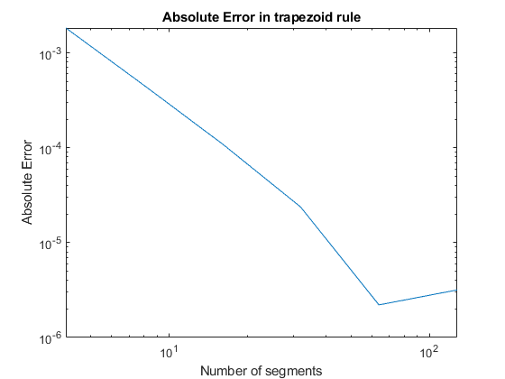
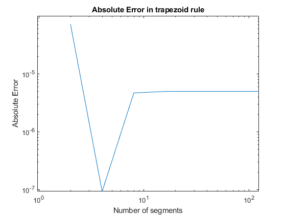
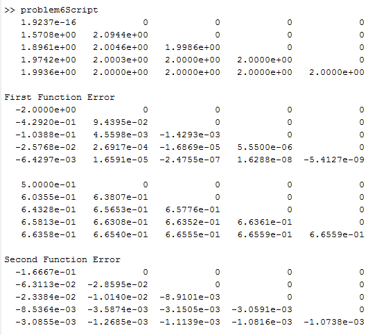

```{r include = FALSE}
# refresh environment
rm(list = ls())
library(dplyr) # utility package for tidyverse
library(tidyverse)
```

# Problem 1

Data table for $f(x) = e^{-x}, x \in [0,0.8]$

$$
\begin{tabular}{c|c|c|c|c|c}
x & 0.0 & 0.2 & 0.4 & 0.6 & 0.8 \\
f(x) & 1 & 0.818731 & 0.670320 & 0.548812 & 0.449329
\end{tabular}
$$

## a. Write out the trapezoid rule and compute with 6 digits

Recall the trapezoid rule:

\[T(f;h) = h[\frac12f(x_0) + \Sigma f(x_i) + \frac12 f(x_n)]\]
\[T(e^{-x};0.2) = 0.2[\frac12(1)+\frac120.4493 + 0.8187 + 0.6703 + 0.5488]\]
\[T(e^{-x};0.2) = 0.552505\]

## b. Write out Simpson's rule and compute with 6 digits

Recall Simpson's rule:

\[S(f;h) = \frac{h}3[f(x_0) + 4\Sigma f(x_{2i-1}) + 2\Sigma f(x_{2i}) + f(x_{2n})]\]
\[S(f;h) = 0.550676\]

## c. What is exact value of integral? What is each absolute error? Which method is better?

Actual value is:

\[1-e^{-\frac45} = 0.550671\]

Abs error of Trapezoid is $0.552505 - 0.550671 = 0.001834$, while Simpson's rule had $0.550676 - 0.550671 = 0.00005$. Simpson's method clearly worked better in terms of error.

## Given the error formula for each rule, how many points would each method need for an error bound of $10^-4$?

Trapezoid Rule:

\[-\frac{0.8}{12}h^2e^{-0} \leq 10^{-4}\]
\[h^2 \leq 15*10^{-4}\]
\[h \leq 0.038730\]
\[n \geq 20.66 \]

This requires at least 22 points. Simpson's Rule:

\[-\frac{0.8}{180}h^4\leq 10^{-4}\]
\[h^4 \leq 225 * 10^{-4}\]
\[h \leq 0.38730\]
\[n \geq 1.033\]

This methods requires at least 5 points. Much less!

# Problem 2, Simpson's Rule


## a. Calculate the given function on [0,1]

Recall the rule:

\[S(f;h) = \frac{h}3[f(x_0) + 4\Sigma f(x_{2i-1}) + 2\Sigma f(x_{2i}) + f(x_{2n})]\]
\[S(f;h) = 0.48\]

## b. Tolerance is 10^-6^. How many points do you need?

\[-\frac{1}{180}h^4(-1.25)\leq 10^{-6}\]
\[h^4 \leq 144 * 10^{-6}\]
\[h \leq 0.1095445\]
\[n \geq 9.129\]

For an error tolerance of 10^-6^, Simpson's rule would need at least 20 points.


# Problem 3, Trapezoid Rule and Romberg

## a. Compute the trapezoid rule for the integral for n = 1,2

\[f(x) = 3x^2, [a,b] =[-1,1]\]

Recall the rule:

\[T(f;h) = h[\frac12f(x_0) + \Sigma f(x_i) + \frac12 f(x_n)]\]

n = 1 evaluates to 6

$$
\begin{tabular}{c|c|c}
x & -1 & 1 \\
f(x) & 3 & 3
\end{tabular}
$$

n = 2 evalutes to 3

$$
\begin{tabular}{c|c|c|c}
x & -1 & 0 & 1 \\
f(x) & 3 & 0 & 3
\end{tabular}
$$

## b. Evaluate with Romberg until you get the exact value.

The exact value of x^3^ evaluated at [-1,1] is 2.

With n = 4 we now evalute to 2.25.

$$
\begin{tabular}{c|c|c|c|c|c}
x & -1 & -0.5 & 0 & 0.5 & 1 \\
f(x) & 3 & 0.75 & 0 & 0.75 & 3
\end{tabular}
$$

With n = 8 we then yield 2.0625. With n = 16 we then yield 2.015625. With n = 32 we then yield 2.003906, so we are getting closer, but we are not getting the exact value.

## c. 

w = 1 and a = 0.577350 (or 1/$\sqrt3$) works for any polynomial of degree 3 or less. We derived this in lecture.

# Problem 4

Trapezoid Function:

```{}
function v=trapezoid(fun,a,b,n)
%TRAPEZOID numerical integration by trapezoid rule
h=(b-a)/n;
xi=a:h:b;
v = h*(0.5*feval(fun,xi(1))+sum(feval(fun,xi(2:1:end-1)))+0.5*feval(fun,(xi(end))));
end
```

Script:

```{}
n = [4 8 16 32 64 128];
actual = 0.550676;
absErr = zeros(1,length(n));

for i = 1:length(n)
    % func is e^-x
   val = trapezoid('func',0,0.8,n(i));
   absErr(i) = val - actual;
   disp(val)
end

figure
loglog(n, absErr)
title('Absolute Error in trapezoid rule')
xlabel('Number of segments')
ylabel('Absolute Error')
```

And figure 1 is the plot of the error:



When n is doubled the error value appears to cut by a factor of 4 times.

# Problem 5

Simpson Function:

```{}
function v=Simpson(fun,a,b,n)
%SIMPSON numerical integration using simpson's rule
    h=(b-a)/n; xi=a:h:b;
    v= h/3*(feval(fun,xi(1))+2*sum(feval(fun,xi(3:2:end-2)))+4*sum(feval(fun,xi(2:2:end)))+feval(fun,xi(end)));
end
```

Script:

```{}
n = [2 4 8 16 32 128];
actual = 0.550676;
absErr = zeros(1,length(n));

for i = 1:length(n)
    % func is e^-x
   val = Simpson('func',0,0.8,n(i));
   absErr(i) = abs(val - actual);
   disp(val)
end

figure
loglog(n, absErr)
title('Absolute Error in trapezoid rule')
xlabel('Number of segments')
ylabel('Absolute Error')
```

When n is doubled here, at least from n = 2 to n = 4, the error is decreased about 70 times.

Figure 2 is the plot:



# Problem 6

Romberg script:

```{}
function r = romberg(fun,a,b,n)
h = (b - a) ./ (2.^(0:n-1));
r(1,1) = (b - a) * (feval(fun,a) + feval(fun,b)) / 2;
for j = 2:n
    subtotal = 0;
    for i = 1:2^(j-2)
        subtotal = subtotal + feval(fun,a + (2 * i - 1) * h(j));
    end
    r(j,1) = r(j-1,1) / 2 + h(j) * subtotal;
    for k = 2:j
        r(j,k) = (4^(k-1) * r(j,k-1) - r(j-1,k-1)) / (4^(k-1) - 1);
    end
end
```

Function files:

```{}
function v=func(x)
    %v = exp(-1.*x);
    %v = cos(2.*x).*exp(-1.*x);
    v = sin(x);
    %v = x.^0.5;
end

function v=f(x)
    %v = exp(-1.*x);
    %v = cos(2.*x).*exp(-1.*x);
    %v = sin(x);
    v = x.^0.5;
end
```

Script file

```{}
rows = 5;
vals = romberg('func',0,pi,rows);
act = 2;

format short e;
disp(vals)
for i = 1:rows
    for j = 1:rows
        if vals(i,j) == 0
            continue
        else
            vals(i,j) = vals(i,j) - act;
        end
    end
end

disp('First Function Error')
disp(vals)

rows = 5;
vals = romberg('f',0,1,rows);
act = 2/3;
disp(vals)
for i = 1:rows
    for j = 1:rows
        if vals(i,j) == 0
            continue
        else
            vals(i,j) = vals(i,j) - act;
        end
    end
end

disp('Second Function Error')
disp(vals)
```

Tables in figure 3:



q = quad('f',0,1,1e-9)

q =

>>   6.6667e-01

 w = quad('func',0,pi,1e-9)

w =

>>   2.0000e+00

q = quadl('f',0,1,1e-9)

q =

>> 6.6667e-01

w = quadl('func',0,pi,1e-9)

w =

>>   2.0000e+00

These quadrature approaches are spot on.

# Problem 7

## a. Calculate J at n = 1,3,9

I use the trapezoid formula:

\[T(f;h) = h[\frac12f(x_0) + \Sigma f(x_i) + \frac12 f(x_n)]\]

```{}
n = [1 3 9];

for i = 1:length(n)
    space = 1 / n(i);
    x = 0:space:1;
    y = zeros(1,length(x));
    y(1) = 1;
    y(2:end) = func(x(2:end));
    val = trapz(space,y);
    disp(val)
end
```

Gives us:

$$
\begin{tabular}{c|c|c|c}
n & 1 & 3 & 9 \\
J & 0.9207355 & 0.9432914 & 0.9457732
\end{tabular}
$$

I use my romberg fomula:

```{}
function r = romberg(fun,a,b,n)
h = (b - a) ./ (2.^(0:n-1));
r(1,1) = (b - a) * (feval(fun,a) + feval(fun,b)) / 2;
for j = 2:n
    subtotal = 0;
    for i = 1:2^(j-2)
        subtotal = subtotal + feval(fun,a + (2 * i - 1) * h(j));
    end
    r(j,1) = r(j-1,1) / 2 + h(j) * subtotal;
    for k = 2:j
        r(j,k) = (4^(k-1) * r(j,k-1) - r(j-1,k-1)) / (4^(k-1) - 1);
    end
end
```

Gives us figure 4:


# Problem 8

## a.

We want to assure that this quadrature gives us the exact value for any polynomial of degree 7 or less.

Let's check:

f(x) = 1, The actual value from [-1,1] is 2, x is 0, x^2^ is 2/3, x^3^ is 0, x^4^ is 2/5, x^5^ is 0, x^6^ is 2/7, and x^7^ is 0.

Using the values in matlab we get the following printout:

```{}
x = [-((3 - 4 * 0.3 ^ 5) / 7)^0.5 -((3 + 4 * 0.3 ^ 5) / 7)^0.5 ((3 - 4 * 0.3 ^ 5) / 7)^0.5 ((3 + 4 * 0.3 ^ 5) / 7)^0.5]
```

>>  -0.653592271330420  -0.655713352006805   0.653592271330420   0.655713352006805

```{}
a = [0.5 + (10/3)^0.5 / 12 0.5 - (10/3)^0.5 / 12 0.5 + (10/3)^0.5 / 12 0.5 - (10/3)^0.5 / 12]

```

>>   0.652145154862546   0.347854845137454   0.652145154862546   0.347854845137454

a(1)+a(2)+a(3)+a(4)

ans =

>>     2

a(1)*x(1) + a(2)*x(2) + a(3)*x(3) + a(4)*x(4)

ans =

>>    -5.551115123125783e-17

a(1)*x(1)^2 + a(2)*x(2)^2 + a(3)*x(3)^2 + a(4)*x(4)^2

ans =

>> 0.856297799482706

a(1)*x(1)^3 + a(2)*x(2)^3 + a(3)*x(3)^3 + a(4)*x(4)^3

ans =

>>    -1.387778780781446e-17

a(1)*x(1)^4 + a(2)*x(2)^4 + a(3)*x(3)^4 + a(4)*x(4)^4

ans =

>>   0.366626459899463

a(1)*x(1)^5 + a(2)*x(2)^5 + a(3)*x(3)^5 + a(4)*x(4)^5

ans =

>>     0

a(1)*x(1)^6 + a(2)*x(2)^6 + a(3)*x(3)^6 + a(4)*x(4)^6

ans =

>>   0.156973714736308

a(1)*x(1)^7 + a(2)*x(2)^7 + a(3)*x(3)^7 + a(4)*x(4)^7

ans =

>>     0

## b.

If we want our polynomial to be correct for all polynomials for degree less than or equal to two we can set up a system of equations to find our uknowns:

\[f(x) = 1 : a_1 + a_2 + a_3 = 2\]
\[f(x) = x: -0.5*a_1 + 0*a_2 + 0.5*a_3 = 0\]
\[f(x) = x^2: -0.5*a_1 + 0*a_2 + 0.5*a_3 = \frac23\]

Now solve!

\[a_1 + a_2 + a_3= 2\]
\[-0.5a_1 + 0.5a_3 = 0\]
\[-0.5a_1+0.5a_3 = \frac23\]

We can add the second and third:

\[a_3 = \frac23\]

Plug back into number 2:

\[-\frac12a_1 = -\frac12\frac23\]
\[a_1 = \frac23\]

Plugging into the first equation we have:

\[\frac23 + a_2 + \frac23 = 2\]
\[a_2 + \frac43 = 2\]
\[a_2 = \frac63 - \frac43\]
\[a-2 = \frac23\]

So all three values $a_1, a_2, a_3 = \frac23$.


