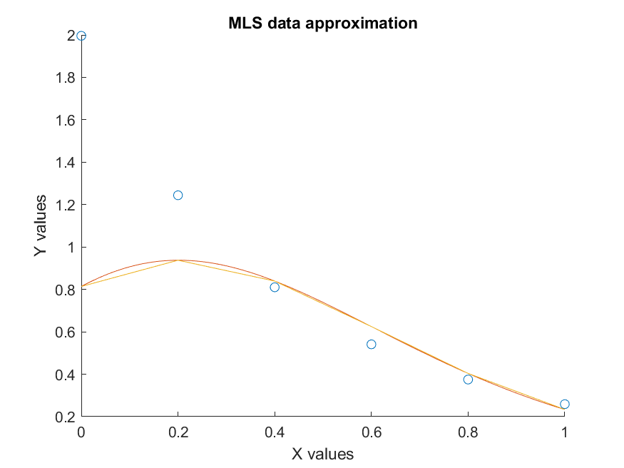
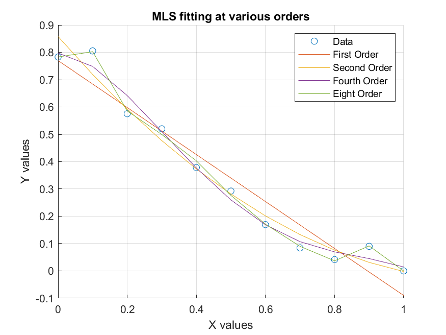
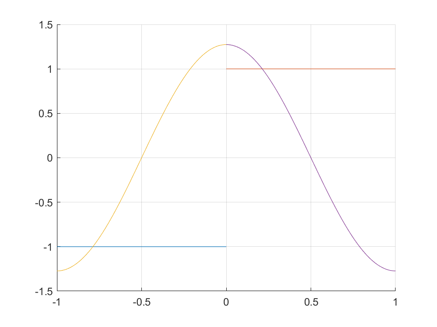

```{r include = FALSE}
# refresh environment
rm(list = ls())
library(dplyr) # utility package for tidyverse
library(tidyverse)
```

# Problem 1 Simplest problem using least squares method

## a. Find the constant function that best fits the data.

$$
\begin{array}{c|c|c|c|} 
x & -1 & 2 & 3\\
y & \frac54 & \frac43 & \frac5{12}\\
\end{array}
$$

A constant function is of the form $f(x) = c$, so in this case we are looking for a value of c that minimizes the error function:

\[\psi(c) = \Sigma(f(x_k) - y_k)^2 = \Sigma(c - y_k)^2\]

In order to minimize this function, the derivative $\frac{d\psi}{dc}$ must be zero. So we get the normal equation:

\[\Sigma2(c - y_k)=0\]

We can rewrite this as:

\[(m+1)c = \Sigma y_k\]

We know we have $m+1 = 3$ and $\Sigma y_k = 3$.

\[3*c = 3\]
\[c = 1\]

So our constant function of best fit is $f(x) = 1$.

## b. Find the value c such that the function f(x) = c best approximates the data.

This is again using a constant equation as a line of best fit to our data. We have the following data and normal equation from the previous problem.

\[\Sigma2(c - y_k)=0\]

We can rewrite this as:

\[(m+1)c = \Sigma y_k\]

$$
\begin{array}{c|c|c|c|} 
x & 1.4 & 1.5 & 1.4\\
y & -0.1 & 0 & 0.1\\
\end{array}
$$

With $m+1 = 3$ and $\Sigma y_k = 0$, we can fill in our normal equation:

\[3*c = 0\]
\[c = 0\]

This makes our line of best fit:

\[f(x) = c = 0\]

# Problem 2 MLS with polynomial regression

## a. What straight line best fits the following data (using least squares)?

$$
\begin{array}{c|c|c|c|c|} 
x & 1 & 2 & 3 & 4\\
y & 0 & 1 & 1 & 2\\
\end{array}
$$

We can use the normal equations that we dervied similarly to the constant equation in the last example:

\[\Sigma x_k^2*a + \Sigma x_k * b = \Sigma x_k * y_k\]
\[\Sigma x_k * a + (m + 1)*b = \Sigma y_k\]

Let's calculate our values:

$$
\begin{array}{c|c|} 
m+1 & 4\\
\Sigma x_k^2 & 30\\
\Sigma x_k & 10\\
\Sigma x_k*y_k & 13\\
\Sigma y_k & 4
\end{array}
$$

This gives us the following matrix:

$$
\left(\begin{array}{cc} 
30 & 10\\
10 & 4
\end{array}\right)
\left(\begin{array}{c} 
a \\
b 
\end{array}\right) =
\left(\begin{array}{c}
13 \\
4 
\end{array}\right)
$$

Solving this matrix we get:

$$
\left(\begin{array}{cc} 
1 & 0\\
0 & 1
\end{array}\right)
\left(\begin{array}{c} 
a \\
b 
\end{array}\right) =
\left(\begin{array}{c}
0.6 \\
-0.5 
\end{array}\right)
$$

This means our line of best fit is:

\[f(x) = 0.6x - 0.5\]

## b. Using MLS represent the data as a parabolic function.

In this case instead of using $y = ax + b$ for our line of best fit, we use $y = ax^2 + b$. This means we must adapt our normal equation, since the partial derivative of our error function with respect to a will change. Our new normal functions will be:

\[\Sigma x_k^4*a + \Sigma x_k^2 * b = \Sigma x_k^2 * y_k\]
\[\Sigma x_k^2 * a + (m + 1)*b = \Sigma y_k\]

Now let's use our data to fill in the values that we need.

$$
\begin{array}{c|c|c|c|} 
x & -1 & 0 & 1\\
y & 3.1 & 0.9 & 2.9\\
\end{array}
$$

$$
\begin{array}{c|c|} 
m+1 & 3\\
\Sigma x_k^2 & 2\\
\Sigma x_k^4 & 2\\
\Sigma x_k^2y_k & 6\\
\Sigma y_k & 6.9
\end{array}
$$

This gives us the following matrix:

$$
\left(\begin{array}{cc} 
2 & 2\\
2 & 3
\end{array}\right)
\left(\begin{array}{c} 
a \\
b 
\end{array}\right) =
\left(\begin{array}{c}
6 \\
6.9 
\end{array}\right)
$$

Solving this matrix we get:

$$
\left(\begin{array}{cc} 
1 & 0\\
0 & 1
\end{array}\right)
\left(\begin{array}{c} 
a \\
b 
\end{array}\right) =
\left(\begin{array}{c}
2.1 \\
0.9 
\end{array}\right)
$$

This means our parabolic line of best fit is:
\[y = 2.1x^2 + 0.9\]

## c. Find the values a and b such that the function g(x) = ax+b best approximates the data.

$$
\begin{array}{c|c|c|c|} 
x & 1.4 & 1.5 & 1.4\\
y & -0.1 & 0 & 0.1\\
\end{array}
$$

Here we once again are using a linear function as the line of best fit. We can use our normal functions:

\[\Sigma x_k^2*a + \Sigma x_k * b = \Sigma x_k * y_k\]
\[\Sigma x_k * a + (m + 1)*b = \Sigma y_k\]

Now let's use our data to fill in the values that we need.

$$
\begin{array}{c|c|} 
m+1 & 3\\
\Sigma x_k^2 & 6.17\\
\Sigma x_k & 4.3\\
\Sigma x_ky_k & 0\\
\Sigma y_k & 0
\end{array}
$$

This gives us the following matrix:

$$
\left(\begin{array}{cc} 
6.17 & 0\\
0 & 3
\end{array}\right)
\left(\begin{array}{c} 
a \\
b 
\end{array}\right) =
\left(\begin{array}{c}
0 \\
0 
\end{array}\right)
$$

Solving this matrix we get:

$$
\left(\begin{array}{cc} 
1 & 0\\
0 & 1
\end{array}\right)
\left(\begin{array}{c} 
a \\
b 
\end{array}\right) =
\left(\begin{array}{c}
0 \\
0 
\end{array}\right)
$$

Meaning that we still get the constant equation that we got for the same data in the first problem in this homework set of $y=0 = 0*x + 0$.


# Problem 3 MLS Non-Polynomial Functions

## a. 

We are given a data set ($x_k, y_k$) with k = 0,...,m. We seek a function of the form:

\[g(x) = \alpha sin(x) + \beta cos(x)\]

that best approximates the data. Set up the normal equations, which solve the problem with the method of least squares.

In order to derive normal functions we must first write out our error function:

\[\Sigma(g(x_k) - y_k)^2=\Sigma(\alpha sin(x) + \beta cos(x)- y_k)^2\]

We know that in order to minimize this error we must set $\frac{d\psi}{d\alpha}$ and $\frac{d\psi}{d\beta}$ to zero.

\[\frac{d\psi}{d\alpha}= \Sigma2(\alpha sin(x_k) + \beta cos(x_k)- y_k)cos(x_k) = 0\]
\[\frac{d\psi}{d\beta}= \Sigma2(\alpha sin(x_k) + \beta cos(x_k)- y_k)-sin(x_k) = 0\]

We can rewrite these equations as:

\[\alpha \Sigma sin(x_k)cos(x_k) + \beta \Sigma cos(x_k)^2 = \Sigma y_kcos(x_k)\]
\[\alpha \Sigma sin(x_k)^2 + \beta \Sigma sin(x_k)cos(x_k) = \Sigma y_ksin(x_k)\]

Compute the values of $\alpha$ and $\beta$ which provide the best fit to the particular data

$$
\begin{array}{c|c|c|c|c} 
x & 1.0 & 1.5 & 2.0 & 2.5\\
y & 1.902 & 0.5447 & -0.9453 & -2.204
\end{array}
$$

Now let's use our data to fill in the values that we need.

$$
\begin{array}{c|c|} 
\Sigma sin(x_k)cos(x_k) & -0.3327\\
\Sigma sin(x_k)^2 & 2.888\\
\Sigma cos(x_k)^2 & 1.112\\
\Sigma y_kcos(x_k) & 3.225\\
\Sigma y_ksin(x_k) & -0.03478
\end{array}
$$

This gives us the following matrix:

$$
\left(\begin{array}{cc} 
-0.3327 & 1.112\\
2.888 & -0.3327
\end{array}\right)
\left(\begin{array}{c} 
\alpha \\
\beta 
\end{array}\right) =
\left(\begin{array}{c}
3.225 \\
-0.03478 
\end{array}\right)
$$

Solving this matrix we get:

$$
\left(\begin{array}{cc} 
1 & 0\\
0 & 1
\end{array}\right)
\left(\begin{array}{c} 
\alpha \\
\beta 
\end{array}\right) =
\left(\begin{array}{c}
0.3336 \\
3 
\end{array}\right)
$$

Meaning our best fit for the given data with our line is $g(x) = 0.3336sin(x) +3cos(x)$

## b.

Let f(x) be a given function. What constant c makes the expression as small as possible.

\[\Sigma[f(x_k)-ce^{x_k}]^2\]

Let's call this expression g(x). In order to minimize g(x) we would want to set the value of $\frac{dg(x)}{dx}$ to zero.

\[\Sigma 2(f(x_k)-ce^{x_k})(f'(x_k)-ce^{x_k}) = 0\]
\[\Sigma (f(x_k)f'(x_k)-f(x_k)ce^{x_k}-f'(x_k)ce^{x_k}+c^2e^{2x_k}) = 0\]
\[\Sigma f(x_k)f'(x_k) = \Sigma (f(x_k)ce^{x_k}+f'(x_k)ce^{x_k}-c^2e^{2x_k})\]

So the smallest c value is:

\[c = \Sigma f(x_k)f'(x_k)/\Sigma (f(x_k)e^{x_k}+f'(x_k)e^{x_k}-e^{2x_k})\]

# Problem 4 Application: A population model

Assume that the growth of the world's population could be describe by the ODE

\[\frac{d}{dt}p(t)=Kp^2(t)\]

where p is the the world population, t is time in years, and K is the growth rate. The general solution of this ODE has the form

\[p(t) = \frac1K*\frac1{t_0-t}\]

for some constants K, t~0~. Throughout the past, we have recorded the following historical data:

$$
\begin{array}{c|c|c|c|c|c|c|c|c|c} 
t & 1650 & 1700 & 1750 & 1800 & 1850 & 1900 & 1920 & 1940 & 1960\\
p & 545 & 623 & 728 & 906 & 1171 & 1608 & 1834 & 2295 & 3003
\end{array}
$$

## a.

Consider the new variables $y=10^6/p$ and $x=t-1830$. Rewrite the equation in the form $y(x)=a_0+a_1x$

\[p(t) = \frac1{K(t_0-t)}\]
\[p=10^6/y;t=x+1830\]
\[10^6/y = \frac1{K(t_0-x-1830)}\]
\[y = 10^6K(t_0-x-1830)\]
\[y = (10^6Kt_0-1830)-10^6Kx\]

In the rewritten form $a_0$ is $10^6Kt_0-1830$ and $a_1$ is $-10^6K$

## b.

Normal equations:

\[\Sigma x_k^2*a + \Sigma x_k * b = \Sigma x_k * y_k\]
\[\Sigma x_k * a + (m + 1)*b = \Sigma y_k\]

Now let's use our data to fill in the values that we need.

$$
\begin{array}{c|c|c|c|c|c|c|c|c|c|} 
x & -180 & -130 & -80 & -50 & 0 & 50 & 70 & 90 & 110\\
y & 1834.86 & 1605.14 & 1373.63 & 1103.75 & 853.97 & 621.89 & 545.26 & 435.73 & 333
\end{array}
$$

$$
\begin{array}{c|c|} 
\Sigma x_k^2 & 85800\\
\Sigma x_k & -120\\
\Sigma x_k * y_k & -558912.5\\
(m + 1) & 9\\
\Sigma y_k & 8707.23\\
\end{array}
$$

This gives us the following matrix:

$$
\left(\begin{array}{cc} 
85800 & -120\\
-120 & 9
\end{array}\right)
\left(\begin{array}{c} 
a_1 \\
a_0 
\end{array}\right) =
\left(\begin{array}{c}
-558912.5 \\
8707.23 
\end{array}\right)
$$

Solving this matrix we get:

$$
\left(\begin{array}{cc} 
1 & 0\\
0 & 1
\end{array}\right)
\left(\begin{array}{c} 
a_1 \\
a_0 
\end{array}\right) =
\left(\begin{array}{c}
-5.2591 \\
897.3487 
\end{array}\right)
$$

## c. 

If we go back to our original variables we get:

\[a_1 = -5.2591 = -10^6K\]
\[K = 0.0000052591\]
\[a_0 = 897.3487 = 10^6Kt_0-1830\]
\[t_0 = 518.596\]

This gives us

\[p(t) = \frac1{0.002727-0.0000052591*t}\]

## d.

Model predictions:

$$
\begin{array}{c|c|c|c} 
t & 1980 & 2000 & 2010\\
p & 4890 & 6450 & 10800
\end{array}
$$

I would say this model likely fits fairly well with our data at minimizing error, but when we try to go past our domain, the error is larger than what we would wish, since in 2011 it is off by a roughly 3 billion people.

# Problem 5 Quasi-Linear MLS

$$
\begin{array}{c|c|c|c|c|c|c} 
x & 0.0 & 0.2 & 0.4 & 0.6 & 0.8 & 1.0\\
y & 1.996 & 1.244 & 0.810 & 0.541 & 0.375 & 0.259
\end{array}
$$

We seek a least squares approximation of the form

\[\overline y(x) = a_0*\frac{e^{a_1x}}{(1+x)^{a_2}}\]

## a. Write the normal equations

\[ln(\overline y(x)) = ln(a_0) + a_1x - a_2ln(1+x)\]

So let's say $S(x) = ln(\overline y(x)), \overline {a_0}=ln(a_0)$ where we are operating on $S(x) = \overline{a_0} +a_1x - a_2ln(1+x)$.

To find the normal equations let's write out the error function and minimize by setting the derivative of each unknown to zero.

\[\Sigma(f(x_k)-S(x_k))^2\]
\[\Sigma((ln(a_0) + a_1x_k - a_2ln(1+x_k))-S(x_k))^2\]

We get our three derivatives:

\[\Sigma2(ln(a_0) + a_1x_k - a_2ln(1+x_k))-S(x_k))*\frac1{a_0}=0\]
\[\Sigma2(ln(a_0) + a_1x_k - a_2ln(1+x_k))-S(x_k))*x_k = 0\]
\[\Sigma2(ln(a_0) + a_1x_k - a_2ln(1+x_k))-S(x_k))*ln(1+x_k)=0\]

Now we can rewrite into our final normal equations:

\[\overline{a_0} + a_1\Sigma x_k - a_2\Sigma ln(1+x_k)= \Sigma S(x_k)\]
\[\overline{a_0}\Sigma x_k + a_1\Sigma x_k^2 - a_2\Sigma x_kln(1+x_k)=\Sigma S(x_k)x_k\]
\[\overline{a_0}\Sigma ln(1+x_k) + a_1\Sigma x_kln(1+x_k) - a_2\Sigma ln(1+x_k)^2=\Sigma S(x_k))ln(1+x_k)\]

## b.

Use matlab to compute the solution to the normal equations. Make a plot which shows the data poitns and the approximation y(x). Compute the sum of squares.

My Script

```{}
x = [0:0.2:1];
y = [1.996 1.244 0.81 0.541 0.375 0.259];
S = log(y);

% Calculate necessary values
temp = log(1+x);
a = sum(temp);
temp = x.*log(1+x);
b = sum(temp);
temp = x.*x;
c = sum(temp);
temp = log(1+x).^2;
d = sum(temp);
e = sum(S);
f = sum(x);
temp = S.*x;
g = sum(temp);
temp = S.*log(1+x);
h = sum(temp);

% Setup matrix
A = [1 f -1*a; f c -1*b; a b -1*d];
b = [e; g; h];

result = A\b;

a0 = exp(result(1));
a1 = result(2);
a2 = result(3);

points = [0:0.001:1];
pointsY = a0.*((exp(a1.*points)) ./ ((1 + points).^a2));
vals = [0:0.2:1];
valsY = a0.*((exp(a1.*vals)) ./ ((1 + vals).^a2));

figure
hold on
scatter(x,y)
plot(points,pointsY)
plot(vals,valsY)
xlabel("X values")
ylabel("Y values")
title("MLS data approximation")


sumOfS = sum((y-valsY).^2);
disp(sumOfS)
```

The sum of squares value was 1.5006 and the figure (fig 1):



# Problem 6 MLS in Matlab

Given the dataset use the Matlab function polyfit to find respectively the first, second, fourth, and eigth order polynomials using the method of least squares. You should also plot your polynomials, together with the data set.

Looking at the figure (fig 2), it is quite clear that increasing order polynomials allow for lower error in the least squares sense.

Script

```{}
% Data Set
x = [0:0.1:1];
y = [0.7829 0.8052 0.5753 0.5201 0.3783 0.2923 0.1695 0.0842 0.0415 0.09 0];

% Polyfit 1, 2, 4, 8 order
first = polyfit(x,y,1);
second = polyfit(x,y,2);
fourth = polyfit(x,y,4);
eighth = polyfit(x,y,8);

% calculate model y values
yOne = polyval(first,x);
yTwo = polyval(second,x);
yFour = polyval(fourth,x);
yEight = polyval(eighth,x);

% plot on figure
figure
hold on
grid on
scatter(x,y)
plot(x,yOne);
plot(x,yTwo);
plot(x,yFour);
plot(x,yEight);
xlabel("X values");
ylabel("Y values");
title("MLS fitting at various orders");
legend('Data','First Order','Second Order','Fourth Order','Eight Order');
```

Figure:




# Problem 7 Least squares approximation of functions

Let f(x) be a function defined on the interval [-1,1], as

$$
f(x) = \begin{cases} 
    -1 & -1 \leq x < 0 \\
    1 & 0 \leq x\leq 1 
\end{cases}
$$

We want to approximate f(x) by a function of the form $g(x) = acos(\pi x) + bsin(\pi x)$. Find the best possible constants a and b, by the method of least squares.

We know that the error function is:

$$
\int_{-1}^{1} (f(x)-g(x))^2dx
$$
$$
\int_{-1}^{1} (f(x)-(acos(\pi x)+bsin(\pi x)))^2dx
$$

In order to minimize this error we must set the partial derivative with respect to both a and b to zero.

$$
-2\int_{-1}^{1} cos(\pi x)(f(x)-(acos(\pi x)+bsin(\pi x)))dx
$$
$$
-2\int_{-1}^{1} sin(\pi x)(f(x)-(acos(\pi x)+bsin(\pi x)))dx
$$

$$
-2\int_{-1}^{1} cos(\pi x)f(x)dx + 2\int_{-1}^{1}cos(\pi x)(acos(\pi x)+bsin(\pi x))dx
$$
$$
-2\int_{-1}^{1} sin(\pi x)f(x)dx +2\int_{-1}^{1}sin(\pi x)(acos(\pi x)+bsin(\pi x))dx
$$

Since we want to set them equal to zero we can say:

$$
a\int_{-1}^{1}cos(\pi x)^2+b\int_{-1}^{1}cos(\pi x)sin(\pi x)dx=\int_{-1}^{1} cos(\pi x)f(x)dx
$$
$$
a\int_{-1}^{1}sin(\pi x)cos(\pi x)+b\int_{-1}^{1}sin(\pi x)^2dx=\int_{-1}^{1} sin(\pi x)f(x)dx
$$

So now we make and solve our matrix. The values we need:

$$
\begin{array}{c|c|} 
\int_{-1}^{1}cos(\pi x)^2 & 1\\
\int_{-1}^{1}cos(\pi x)sin(\pi x)dx & 0\\
\int_{-1}^{1} cos(\pi x)f(x)dx & 0\\
\int_{-1}^{1}sin(\pi x)^2dx & 1\\
\int_{-1}^{1} sin(\pi x)f(x)dx & \frac4{\pi}\\
\end{array}
$$

This gives us the following matrix:

$$
\left(\begin{array}{cc} 
1 & 0\\
0 & 1
\end{array}\right)
\left(\begin{array}{c} 
a \\
b 
\end{array}\right) =
\left(\begin{array}{c}
0 \\
\frac4{\pi} 
\end{array}\right)
$$

This is already essentially solved, so the best possible constants a and b for our function g(x) are $a=0;b=\frac4{\pi}$. This gives us the equation:

\[g(x) = \frac{4cos(\pi x)}{\pi}\]

Below is a graph of what the plot looks like (fig 3):




