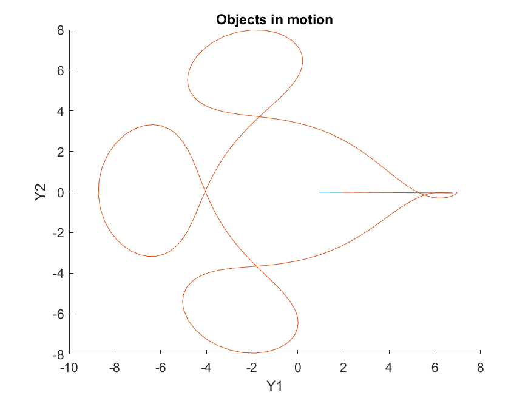
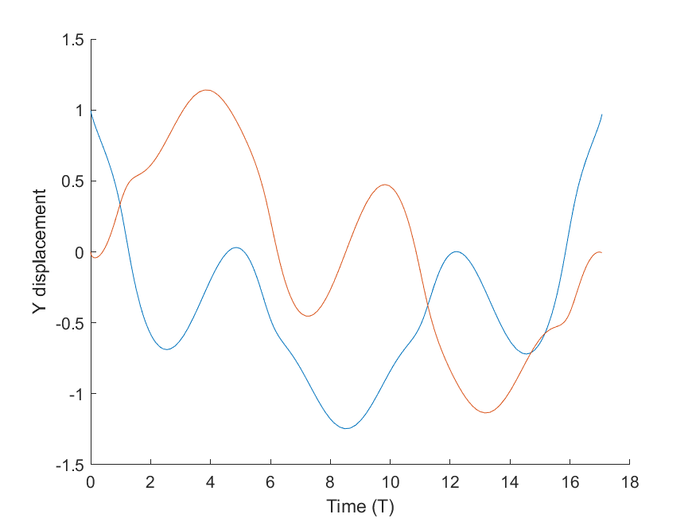

```{r include = FALSE}
# refresh environment
rm(list = ls())
library(dplyr) # utility package for tidyverse
library(tidyverse)
```

# Problem 1 Scalar ODE

\[x' = 2x^2 + x - 1, x(1) = 1\]

## a.

Write out Euler's method for this ODE. Compute the value of x(1.2) usign Euler's method, with h = 0.1.

Recall Euler's method itself:

\[x_1 = x_0 + hx'(t_0) = x_0 + h*f(t_0,x_0)\]

Let's compute to x(1.2):

\[x(1.1) = x_0 + hf(t_0,x_0) = 1 + 0.1 * 2 = 1.2\]
\[x(1.2) = x_1 + hf(t_1,x_1) = 1.2 + 0.1 * 3.08 = 1.508\]

## b.

Write out Heun's method for this ODE. Compute the value x(1.2) by Heun's method with h = 0.1.

Recall Heun's method:

\[x_{k+1} = x_k + \frac12(K_1 + K_2)\]
\[K_1 = h*f(t_k, x_k)\]
\[K_2 = h*f(t_k + h, x_k + K_1)\]

Let's compute to x(1.2):

At $x_0 = 1, t_0 = 1$:

\[K_1 = 0.1 * 2 = 0.2\]
\[K_2 = 0.1 * 3.08 = 0.308\]
\[x(1.1) = 1 + \frac12(0.2 + 0.308) = 1.254\]

At $x_1 = 1.254, t_0 = 1.1$:

\[K_1 = 0.1 * 3.399 = 0.3399\]
\[K_2 = 0.1 * 5.6749 = 0.5675\]
\[x(1.2) = 1.254 + \frac12(0.3399 + 0.5675) = 1.7077\]

## c

Write out the classic 4th order RK method for this ODE. Compute the value x(1.2) by RK4 method with h = 0.1.

Recall RK4 method:

\[x_{k+1} = x_k + \frac16(K_1 + 2K_2 + 2K_3 + K_4)\]
\[K_1 = h*f(t_k, x_k)\]
\[K_2 = h*f(t_k + \frac12h, x_k + \frac12K_1)\]
\[K_3 = h*f(t_k + \frac12h, x_k + \frac12K_2)\]
\[K_4 = h*f(t_k + h, x_k + K_3)\]

At $x_0 = 1, t_0 = 1$:

\[K_1 = 0.1 * 2 = 0.2\]
\[K_2 = 0.1 * 2.52 = 0.252 \]
\[K_3 = 0.1 * 2.6618 = 0.2662\]
\[K_4 = 0.1 * 3.2333 = 0.3233\]
\[x(1.1) = 1 + \frac16(0.2 + 2 * 0.252 + 2 * 0.2262 + 0.3233) = 1.247\]

At $x_1 = 1.247, t_0 = 1.1$

\[K_1 = 0.1 * 1.802 = 0.1802\]
\[K_2 = 0.1 * 2.467 = 0.2467\]
\[K_3 = 0.1 * 2.647 = 0.2647\]
\[K_4 = 0.1 * 3.464 = 0.3464\]
\[x(1.2) = 1.247 + \frac16(0.1802 + 2 * 0.2467 + 2 * 0.2647 + 0.3464) = 1.505\]

## d

Write out 2nd order ABM method for this ODE. Note that this is a multi-step method. it needs 2 initial values to initiate the iterations. For the second initial value you can use the result obtained in part b with Heun's method. Compute the values x(1.2) and x(1.3) using the ABM method.

Here we add the intial value $x_1 = 1.1, t_1 = 1.254$. Recall the ABM method:

\[x_{n+1} = x_n + \frac{h}2(3f(t_n,x_n) - f(t_{n-1}, x_{n-1}))\]

To compute $x(1.2) = x_2$:

\[x(1.2) = 1.254 + 0.1/ 2 * (3*3.399 - 2) = 1.664\]

To compute $x(1.3) = x_3$:

\[x(1.3) = 1.664 + 0.1/2 *(3*6.2018 - 3.399) = 2.424\]

# Problem 2

Given the following high order ordinary differential equation

\[x'''(t) = -2x'' + xt, x(0) = 1, x'(0) = 2, x''(0) = 3\]

## a

Rewrite the equation into a system of first order equations. Make sure to include the intial conditions.

$$
\begin{cases} 
      x'_1 = x_2 \\
      x'_2 = x_3 \\
      x'_3 = -2x_3 + x_1t\\  
\end{cases}
$$

Initial values at $t = 0$:

$$
\begin{cases} 
      x_1 = 1 \\
      x_2 = 2 \\
      x_3 = 3 \\
\end{cases}
$$

## b

Set up the forward Euler step for the system in (a) with h = 0.1

Recall the forward Euler method:

\[x_{k+1} = x_k + hx'(t_k) = x_k + h*f(t_k,x_k)\]

Here we have the values:

\[x_k = (x_1^0, x_2^0, x_3^0)^T\]

This first vector is our initial condition.

\[x_k' = (x_1', x_2',x_3')^T = (x_2^0, x_3^0, -2x_3^0+x_1^0t_0)^T\]

This gives us the setup:

\[x_{k+1} = x_k + 0.1 * x_k' = (x_1^0, x_2^0, x_3^0)^T + 0.1 * (x_2^0, x_3^0, -2x_3^0+x_1^0t_0)^T\]

## c

Write a Matlab script that computes 10 Euler steps, to obtain the value of $x_10 \approx x(1)$

My scipt:

```{}
% Setup intial conditions
% t starts at zero
t = 0;
h = 0.1;
xPrev = [1; 2; 3;];
xPrevPrime = [xPrev(2); xPrev(3); myFunc(xPrev, t)];

for i = 1:10
   xPrev =  xPrev + h .* xPrevPrime;
   xPrevPrime = [xPrev(2); xPrev(3); myFunc(xPrev, t)];
   % increment t
   t = t + h;
end

disp(xPrev)
disp(t)

% differential equations
function out=myFunc(x, t) 
    out = -2 * x(3) + x(1) * t;
end
```

My output (value of x(1) and value of t):

Problem2Script

* 3.8514
* 3.4875
* 1.0241

* 1.0000

# Problem 3

Given the second order equation:

\[x'' -tx = 0, x(0) = 1, x'(0) = 1\]

rewrite it as a system of first order equations.

Compute x(0.1) and x(0.2) with 2 time steps using h = 0.1 using the following methods.

System:

$$
\begin{cases} 
      x'_1 = x_2 \\
      x'_2 = tx_2 \\ 
\end{cases}
$$

Initial values at $t_0 = 0$:

$$
\begin{cases} 
      x_1 = 1 \\
      x_2 = 1 \\
\end{cases}
$$

## a. Euler's method

Recall the forward Euler method:

\[x_{k+1} = x_k + hx'(t_k) = x_k + h*f(t_k,x_k)\]

$$
\left(\begin{array}{c} 
x_1^1\\
x_2^1
\end{array}\right)=
\left(\begin{array}{c} 
x_1^0 \\
x_2^0 
\end{array}\right) + 0.1 *
\left(\begin{array}{c}
x_2^0 \\
tx_2^0 
\end{array}\right)
$$

$$
\left(\begin{array}{c} 
x_1^1\\
x_2^1
\end{array}\right)=
\left(\begin{array}{c} 
1 \\
1 
\end{array}\right) + 0.1 *
\left(\begin{array}{c}
1 \\
0 * 1 
\end{array}\right)
$$

$$
\left(\begin{array}{c} 
x_1^1\\
x_2^1
\end{array}\right)=
\left(\begin{array}{c} 
1.1 \\
1 
\end{array}\right)
$$

So x(0.1) is 1.1.

$$
\left(\begin{array}{c} 
x_1^2\\
x_2^2
\end{array}\right)=
\left(\begin{array}{c} 
x_1^1 \\
x_2^1 
\end{array}\right) + 0.1 *
\left(\begin{array}{c}
x_2^1 \\
tx_2^1 
\end{array}\right)
$$

$$
\left(\begin{array}{c} 
x_1^2\\
x_2^2
\end{array}\right)=
\left(\begin{array}{c} 
1.1 \\
1 
\end{array}\right) + 0.1 *
\left(\begin{array}{c}
1 \\
0.1*1 
\end{array}\right)
$$

$$
\left(\begin{array}{c} 
x_1^1\\
x_2^1
\end{array}\right)=
\left(\begin{array}{c} 
1.2 \\
1.01 
\end{array}\right)
$$

So x(0.2) is 1.2.

## b. 2nd order Runge Kutta

Heun's method is a 2nd order Runge Kutta:

\[x_{k+1} = x_k + \frac12(K_1 + K_2)\]
\[K_1 = h*f(t_k, x_k)\]
\[K_2 = h*f(t_k + h, x_k + K_1)\]

$$
\left(\begin{array}{c} 
x_1^1\\
x_2^1
\end{array}\right)=
\left(\begin{array}{c} 
x_1^0 \\
x_2^0 
\end{array}\right) + 0.5 *
\left(\begin{array}{c}
0.1 * x_2^0 + 0.1 * (x_2^0 + 0.1 * x_2^0) \\
0.1 * tx_2^0 + 0.1 * (t(x_2^0 + 0.1 * tx_2^0)) 
\end{array}\right)
$$
$$
\left(\begin{array}{c} 
x_1^1\\
x_2^1
\end{array}\right)=
\left(\begin{array}{c} 
1 \\
1 
\end{array}\right) + 0.5 *
\left(\begin{array}{c}
0.1 * 1 + 0.1 * (1 + 0.1 * 1) \\
0.1 * 0 *1 + 0.1 * ( 0 (1 + 0.1 * 0 * 1)) 
\end{array}\right)
$$
$$
\left(\begin{array}{c} 
x_1^1\\
x_2^1
\end{array}\right)=
\left(\begin{array}{c} 
1 \\
1 
\end{array}\right) + 0.5 *
\left(\begin{array}{c}
0.21 \\
0 
\end{array}\right)
$$
$$
\left(\begin{array}{c} 
x_1^1\\
x_2^1
\end{array}\right)=
\left(\begin{array}{c} 
1.105 \\
1
\end{array}\right)
$$

So x(0.1) is 1.105.

$$
\left(\begin{array}{c} 
x_1^2\\
x_2^2
\end{array}\right)=
\left(\begin{array}{c} 
x_1^1 \\
x_2^1 
\end{array}\right) + 0.5 *
\left(\begin{array}{c}
0.1 * x_2^1 + 0.1 * (x_2^1 + 0.1 * x_2^1) \\
0.1 * tx_2^1 + 0.1 * (t(x_2^1 + 0.1 * tx_2^1)) 
\end{array}\right)
$$

$$
\left(\begin{array}{c} 
x_1^2\\
x_2^2
\end{array}\right)=
\left(\begin{array}{c} 
1.105 \\
1 
\end{array}\right) + 0.5 *
\left(\begin{array}{c}
0.1 * 1 + 0.1 * (1 + 0.1 * 1) \\
0.1 * 0.1 * 1 + 0.1 * (0.1 * (1 + 0.1 * 0.1 * 1)) 
\end{array}\right)
$$

$$
\left(\begin{array}{c} 
x_1^2\\
x_2^2
\end{array}\right)=
\left(\begin{array}{c} 
1.105 \\
1 
\end{array}\right) + 0.5 *
\left(\begin{array}{c}
0.21\\
0.0201 
\end{array}\right)
$$

$$
\left(\begin{array}{c} 
x_1^2\\
x_2^2
\end{array}\right)=
\left(\begin{array}{c} 
1.21 \\
1.01005
\end{array}\right)
$$

So x(0.2) is 1.21.

## c. 4th order Runge Kutta

Classic 4th order RK:

\[x_{k+1} = x_k + \frac16(K_1 + 2K_2 + 2K_3 + K_4)\]
\[K_1 = h*f(t_k, x_k)\]
\[K_2 = h*f(t_k + \frac12h, x_k + \frac12K_1)\]
\[K_3 = h*f(t_k + \frac12h, x_k + \frac12K_2)\]
\[K_4 = h*f(t_k + h, x_k + K_3)\]

$$
\left(\begin{array}{c} 
x_1^1\\
x_2^1
\end{array}\right)=
\left(\begin{array}{c} 
x_1^0 \\
x_2^0 
\end{array}\right) + \frac16 *
\left(\begin{array}{c}
(0.1 * x_0^0) + 0.2 * (x_2^0 + 0.5*(0.1 * x_2^0)) + 0.2 *  ...\\
(0.1 * t*x_0^0) + 0.2 * (t + 0.05 *(x_2^0 + 0.5 * (0.1 * tx_2^0))) + 0.2 * ... 
\end{array}\right)
$$

$$
\left(\begin{array}{c} 
x_1^2\\
x_2^2
\end{array}\right)=
\left(\begin{array}{c} 
1.1052 \\
1.005
\end{array}\right)
$$

So x(0.1) is 1.1052.

$$
\left(\begin{array}{c} 
x_1^2\\
x_2^2
\end{array}\right)=
\left(\begin{array}{c} 
x_1^1 \\
x_2^1 
\end{array}\right) + \frac16 *
\left(\begin{array}{c}
(0.1 * x_0^1) + 0.2 * (x_2^1 + 0.5*(0.1 * x_2^1)) + 0.2 *  ...\\
(0.1 * t*x_0^1) + 0.2 * (t + 0.05 *(x_2^1 + 0.5 * (0.1 * tx_2^1))) + 0.2 * ... 
\end{array}\right)
$$

$$
\left(\begin{array}{c} 
x_1^2\\
x_2^2
\end{array}\right)=
\left(\begin{array}{c} 
1.2109 \\
1.0202
\end{array}\right)
$$

## d. 2nd order ABM

Note that this is a multistep method. For the 2nd initial vlaue $x_1$, you can use the solution $x_1$ from b. For this method please compute x(0.2) and x(0.3).

ABM method:

\[x_{n+1} = x_n + \frac{h}2(3f(t_n,x_n) - f(t_{n-1}, x_{n-1}))\]

$$
\left(\begin{array}{c} 
x_1^2\\
x_2^2
\end{array}\right)=
\left(\begin{array}{c} 
x_1^1 \\
x_2^1 
\end{array}\right) + \frac{h}2 *
\left(\begin{array}{c}
3 * x_2^1 - x_2^0\\
3 * t_1 * x_2^1 - t_0*x_2^0
\end{array}\right)
$$

So for x(0.2):

$$
\left(\begin{array}{c} 
x_1^2\\
x_2^2
\end{array}\right)=
\left(\begin{array}{c} 
1.1052 \\
1.005 
\end{array}\right) + \frac{0.1}2 *
\left(\begin{array}{c}
3 * 1.005 - 1\\
3 * 0.1 * 1.005 - 0*1
\end{array}\right)
$$

$$
\left(\begin{array}{c} 
x_1^2\\
x_2^2
\end{array}\right)=
\left(\begin{array}{c} 
1.2060 \\
1.0201
\end{array}\right)
$$

So x(0.2) is 1.2060 and for x(0.3)

$$
\left(\begin{array}{c} 
x_1^3\\
x_2^3
\end{array}\right)=
\left(\begin{array}{c} 
1.206 \\
1.0201 
\end{array}\right) + \frac{0.1}2 *
\left(\begin{array}{c}
3 * 1.0201 - 1.005\\
3 * 0.2 * 1.0201 - 0.1*1.005
\end{array}\right)
$$

$$
\left(\begin{array}{c} 
x_1^2\\
x_2^2
\end{array}\right)=
\left(\begin{array}{c} 
1.3088 \\
1.0457
\end{array}\right)
$$

So x(0.3) is 1.3088.

# Problem 4

\[d_E = ((y_1 + \mu)^2 + y_2^2)^{1/2}\]
\[d_M = ((y_1 - v)^2 + y_2^2)^{1/2}\]
\[\mu = 0.012277471\]
\[v = 1 - \mu\]

Rewrite system into first order equations.

$$
\begin{cases} 
      y_1' =  x_1\\
      y_2' =  x_2\\
      x_1' = y_1 + 2x_2 - v\frac{y_1+\mu}{d_E^3}-\mu\frac{y_1-v}{d_M^3}\\
      x_2' = y_2 - 2x_1-v\frac{y_2}{d_E^3}-\mu\frac{y_2}{d_M^3}
\end{cases}
$$

Use the Matlab function ode45 to solve this system of ODEs over one period. Draw the orbit.

Figure 1 is the Orbit and y1 and y2 oscillation is figure 2.





Also Matlab code:

```{}
% Setup variables
mu = 0.012277471;
v = 1 - mu;
y = [0.994; 0; 0; -2.0015851063790825];
tSpan = [0 17.065211656];% one period is t = 17.065211656

% Part b ------------------------------------------------------------------
[t, yOut] = ode45(@odefun,tSpan,y);
figure
hold on
plot(t,yOut(:,1))
plot(t,yOut(:,2))
xlabel('Time (T)')
ylabel('Y displacement')

% coords
oneX(length(yOut(:,1)),1) = -1*mu;
oneY(length(yOut(:,2)),1) = 0;
twoX(length(yOut(:,1)),1) = 1-mu;
twoY(length(yOut(:,2)),1) = 0;
oneX = oneX + yOut(:,1);
oneY = oneY + yOut(:,2);
twoX = twoX + yOut(:,1);
twoY = twoY + yOut(:,2);
hold off
figure
hold on
plot(oneX,oneY)
plot(twoX,twoY)
xlabel('Y1')
ylabel('Y2')
title('Objects in motion')

% Forward Euler method-----------------------------------------------------
% Setup intial conditions
% t starts at zero
t = 0;
h = 0.0007110504856666666;
xPrev = y; % initial start
xPrevAhead = y;

for i = 1:24000
   dE = ((xPrev(1) + mu)^2 + xPrev(2)^2)^0.5;
   dM = ((xPrev(1) - v)^2 + xPrev(2)^2)^0.5;
   xPrevPrime = [xPrev(3); xPrev(4); xPrev(1) + 2 * xPrev(4) - v * ((xPrev(1) + mu) /dE^3) - mu * ((xPrev(1) - v) / dM^3);...
       xPrev(2) - 2 * xPrev(3) - v * (xPrev(2) /dE^3) - mu * (xPrev(2) / dM^3)];
   xPrev =  xPrev + h .* xPrevPrime;
   if i == 1
       xPrevAhead = xPrev;
   end
   % increment t
   t = t + h;
end
disp('Y1')
disp(xPrev(1))
disp('Y2')
disp(xPrev(2))
disp('Time')
disp(t)

t = 0;
xPrev = y;
xPrev2 = xPrevAhead;

% Runga Kutta Fourth Boii
for i = 1:6000
   K1 = 0.1 .* [xPrev(3); xPrev(4); xPrev(1) + 2 * xPrev(4) - v * ((xPrev(1) + mu) /dE^3) - mu * ((xPrev(1) - v) / dM^3);...
       xPrev(2) - 2 * xPrev(3) - v * (xPrev(2) /dE^3) - mu * (xPrev(2) / dM^3)];
   K2 = 0.1 .* [xPrev(3) + 0.5 * K1(3); xPrev(4) + 0.5 * K1(4); (xPrev(1) + 0.5 * K1(1)) + 2 * (xPrev(4) + 0.5 * K1(4)) - v * (((xPrev(1) + 0.5 * K1(1)) + mu) /dE^3) - mu * (((xPrev(1) + 0.5 * K1(1)) - v) / dM^3);...
       (xPrev(2) + 0.5 * K1(2)) - 2 * (xPrev(3) + 0.5 * K1(3)) - v * (((xPrev(2) + 0.5 * K1(2))) /dE^3) - mu * (((xPrev(2) + 0.5 * K1(2))) / dM^3)];
   K3 = 0.1 .* [xPrev(3) + 0.5 * K2(3); xPrev(4) + 0.5 * K2(4); (xPrev(1) + 0.5 * K2(1)) + 2 * (xPrev(4) + 0.5 * K2(4)) - v * (((xPrev(1) + 0.5 * K2(1)) + mu) /dE^3) - mu * (((xPrev(1) + 0.5 * K2(1)) - v) / dM^3);...
       (xPrev(2) + 0.5 * K2(2)) - 2 * (xPrev(3) + 0.5 * K2(3)) - v * (((xPrev(2) + 0.5 * K2(2))) /dE^3) - mu * (((xPrev(2) + 0.5 * K2(2))) / dM^3)];
   K4 = 0.1 .* [xPrev(3) + K3(3); xPrev(4) + K3(4); (xPrev(1) + K3(1)) + 2 * (xPrev(4) + K3(4)) - v * (((xPrev(1) + K3(1)) + mu) /dE^3) - mu * (((xPrev(1) + K3(1)) - v) / dM^3);...
       (xPrev(2) + K3(2)) - 2 * (xPrev(3) + K3(3)) - v * (((xPrev(2) + K3(2))) /dE^3) - mu * (((xPrev(2) + K3(2))) / dM^3)];
   
   xPrev = xPrev + 1 / 6 * (K1 + 2 * K2 + 2 * K3 + K4);
   % increment t
   t = t + h;
end

disp('Y1')
disp(xPrev(1))
disp('Y2')
disp(xPrev(2))
disp('Time')
disp(t)

% equations (y is vector)
function out = odefun(t, y)
    mu = 0.012277471;
    v = 1 - mu;
    dE = ((y(1) + mu)^2 + y(2)^2)^0.5;
    dM = ((y(1) - v)^2 + y(2)^2)^0.5;
    out = zeros(4,1);
    out(1) = y(3); % y(1)'
    out(2) = y(4); % y(2)'
    out(3) = y(1) + 2 * y(4) - v * ((y(1) + mu) /dE^3) - mu * ((y(1) - v) / dM^3); % y(1)''
    out(4) = y(2) - 2 * y(3) - v * (y(2) /dE^3) - mu * (y(2) / dM^3); % y(2)''
end
```


